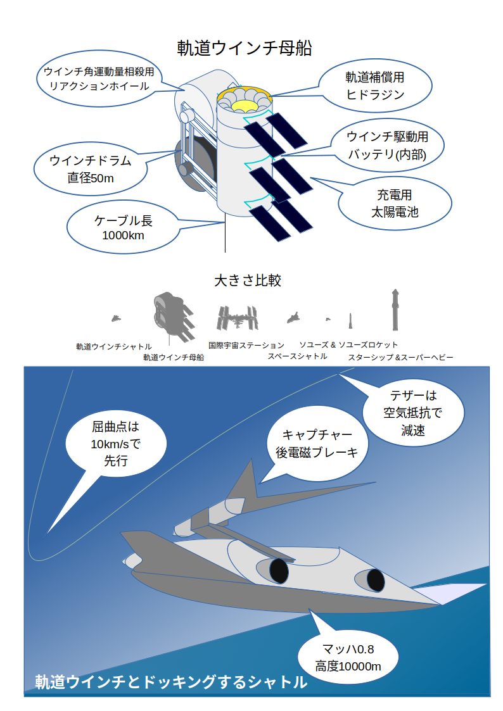
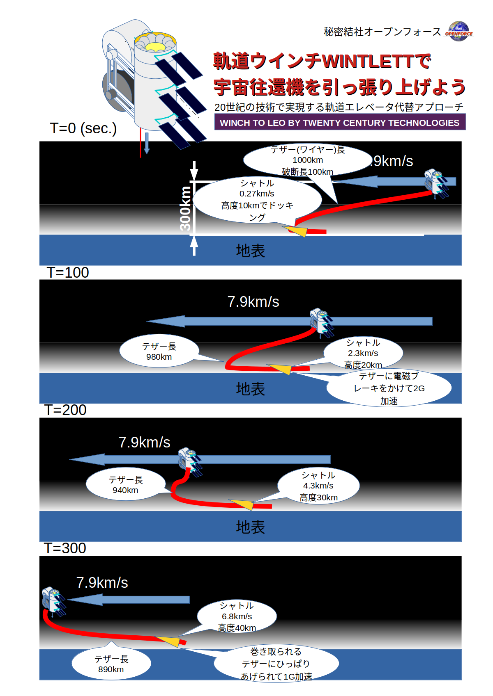

# orbitcalc-book

同人誌「宇宙への架け橋」

軌道ウィンチ WINTELTT を実現するための、理論計算本です。
現在は準備段階として基礎的な計算を行っています。

当初は qiita2review で、現在は VSCode で作成しています

# WINTLETT の説明

# 説明動画
<video src="https://github.com/nanbuwks/orbitcalc-book/blob/main/videos/WINTLETT-DEMO.mp4" style="max-width:730px;"></video>

# pdf 作成方法

- VSCode にて pdf 出力
- addpagenumber.sh を実行してページ番号をつける
