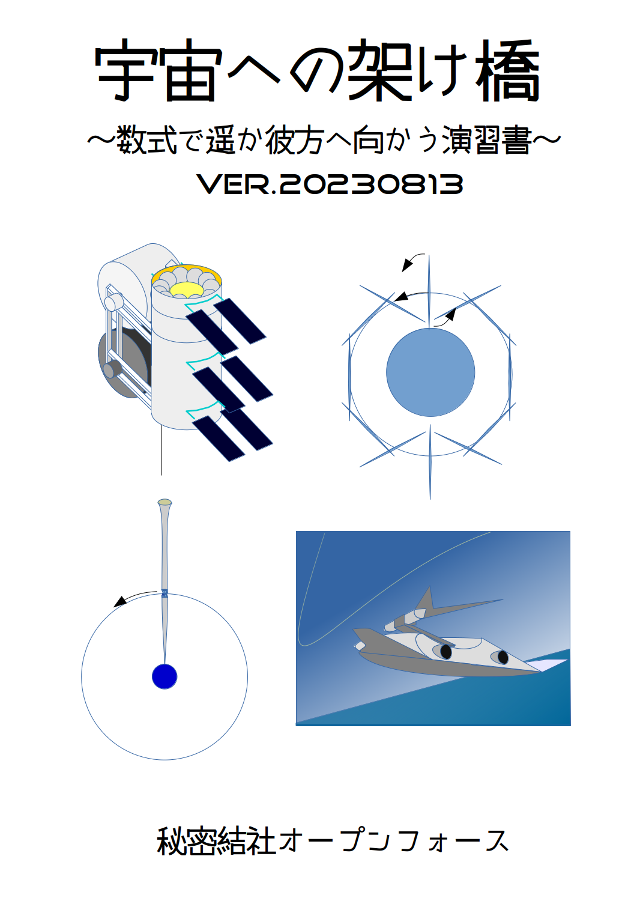
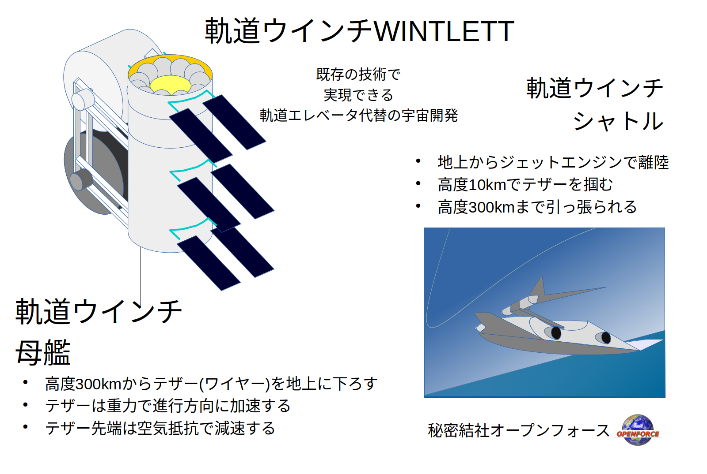
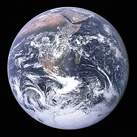
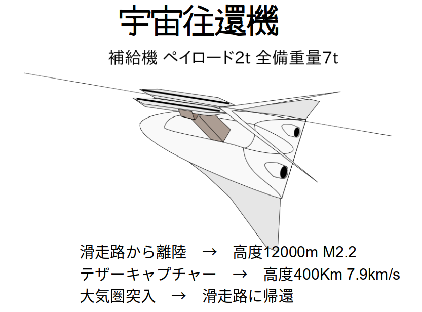

 
 
 
 
 
 
 
 
 
 

# 本書の狙い
## 宇宙に行こう
幾多の人々が天界を既に駆けています。共通の言語、数学によって。
時代、政治、思想が異なっても、同じ世界に行くことができます。
いつの日か、異なる星に住む人たちと話をする時、同じように数学による意思疎通が図られるでしょう。

## 本書において
### ブラックボックスをなるべくなくします。
公式をできる限り導き出すようにします。
自分の手でいちから計算していきます。

### 有効数字は3桁

計算の結果は有効数字内に四捨五入します。
また、計算の途中で導き出した数字も同様に扱います。
単位系はMKS単位系を使います。

### 解答

演習の解答は、全ての答えを載せていません。過程や必要なデータは巻末資料やWebで検索したりして調べてみてください。
回答そのものを記した場合は、計算過程は記しません。回答そのものを記載してない場合は、回答に結びつく資料を書いています。

# 目次

- [本書の狙い](#本書の狙い)
  - [宇宙に行こう](#宇宙に行こう)
  - [本書において](#本書において)
    - [ブラックボックスをなるべくなくします。](#ブラックボックスをなるべくなくします)
    - [有効数字は3桁](#有効数字は3桁)
    - [解答](#解答)
- [目次](#目次)
- [演習編](#演習編)
  - [人類に必要な空間](#人類に必要な空間)
    - [回答？](#回答)
  - [増えすぎた人口](#増えすぎた人口)
    - [回答？](#回答-1)
  - [軌道発電衛星](#軌道発電衛星)
    - [回答？](#回答-2)
  - [宇宙へのコスト](#宇宙へのコスト)
    - [回答？](#回答-3)
  - [宇宙に行く条件は？](#宇宙に行く条件は)
    - [回答？](#回答-4)
  - [第一宇宙速度をすべて位置エネルギーに変換すると？](#第一宇宙速度をすべて位置エネルギーに変換すると)
    - [回答？](#回答-5)
  - [国際宇宙ステーションはどれだけの速さ？](#国際宇宙ステーションはどれだけの速さ)
    - [回答？](#回答-6)
  - [国際宇宙ステーションの位置エネルギーと運動エネルギーの割合は？](#国際宇宙ステーションの位置エネルギーと運動エネルギーの割合は)
    - [回答？](#回答-7)
  - [第二宇宙速度を求めよう！](#第二宇宙速度を求めよう)
    - [回答？](#回答-8)
  - [第三宇宙速度を求めよう！](#第三宇宙速度を求めよう)
    - [回答？](#回答-9)
  - [第二宇宙速度に加速するには？](#第二宇宙速度に加速するには)
    - [回答？](#回答-10)
  - [第三宇宙速度に加速するには？](#第三宇宙速度に加速するには)
  - [第一宇宙速度に加速するには？](#第一宇宙速度に加速するには)
    - [回答？](#回答-11)
  - [重力損失を考える](#重力損失を考える)
    - [回答？](#回答-12)
  - [宇宙へのコスト](#宇宙へのコスト-1)
  - [軌道エレベーターに必要なエネルギー](#軌道エレベーターに必要なエネルギー)
  - [軌道エレベーターの建設コスト](#軌道エレベーターの建設コスト)
  - [軌道エレベータはどこが無理か？](#軌道エレベータはどこが無理か)
    - [回答？](#回答-13)
  - [宇宙に行くための難関](#宇宙に行くための難関)
- [ほんのちょっとだけ WINTLETT](#ほんのちょっとだけ-wintlett)
- [資料篇](#資料篇)
  - [基本的な数値](#基本的な数値)
    - [重力加速度](#重力加速度)
    - [地球の赤道半径](#地球の赤道半径)
    - [地球の軌道半径](#地球の軌道半径)
  - [平均軌道速度](#平均軌道速度)
    - [1年](#1年)
    - [光の速度](#光の速度)
    - [万有引力定数](#万有引力定数)
    - [地球の質量](#地球の質量)
    - [太陽の質量](#太陽の質量)
- [コミックマーケット101版あとがき](#コミックマーケット101版あとがき)

# 演習編
## 人類に必要な空間

立って半畳、寝て一畳という言葉があります。一畳というのは $ 85\times170 〜 100\times200cm $ですが、計算しやすく$ 1m \times 2m $ とします。
世界中の人口70億人として、一人あたり2平方メートルに入れるとすると、どのくらいの面積が必要でしょうか。

1. 四国ぐらい
1. グリーンランドくらい
1. オーストラリア大陸ぐらい

### 回答？

- 佐渡ヶ島　$18,780km^2 $
- グリーンランド $ 2,170,000 km^2 $
- オーストラリア大陸 $ 7,690,000 km^2 $

さて、70億人分のスペースは $ 140億m^2 $ですが・・・？

## 増えすぎた人口
「機動戦士ガンダム」では、宇宙世紀という年号が使われています。UC0079というように、Universal Century を略して使われていて、宇宙移民が始まった年を宇宙世紀元年という設定になっています。

UC0000,人口が90億人。
UC0050,人口110億のうち、90億が宇宙へ。

> "地球の周りには巨大なスペース・コロニーが数百基浮かび、人々はその円筒の内壁を人口の大地とした。その人類の第二の故郷で、人々は子を産み、育て、そして死んでいった。 "
> 　
>
> ー 機動戦士ガンダム(劇場版) オープニング

さて、スペースコロニーは直径4マイル x 長さ20マイル で3枚の地上面を持ちます（オニール・島３号案）。
kmに直すと直径6.4 km、長さ32 kmです。

  

スペースコロニーが数百機ということで、仮に500機としましょう。そのうち、90億人が500機に住むとすると、人口密度はどれほどになるでしょうか。計算してみましょう。

### 回答？

先の図のように、円筒の側面の半分は窓なので、陸の面積 S は
$$ (3.14\times6.4\times32/2)=322[km^2]$$
で人口は一基あたり
$$ 9.0\times10^{9}/5.0\times10^2=1.8\times10^7[人] $$
、すなわち 1800 万人です。とすると人口密度は
$$
1.8\times10^7/3.2\times10^2=〔\hspace{10mm}〕[人/km^2]
$$
参考：東京都の人口密度は面積が$2194km^2$で2022年末頃の人口は $1400万(=1.4\times10^7 )人$ 程度で
人口密度は・・・
$$
1.4\times10^7/2.2\times10^3=〔\hspace{10mm}〕[人/km^2] 
$$

ちなみに、50年間で70億人が宇宙に移民するとなると、1日あたり38万人宇宙に行かないといけません。
羽田空港の利用者が1日17〜19万人。2015年度の渋谷駅1日平均秋葉原駅の利用者が372,234なので、宇宙港がひとつだけならそのくらいの賑わいになりますね！！
## 軌道発電衛星

先の計算は洒落にならなかったですね。人口爆発分をスペースコロニーで吸収するというのはちょっと非現実っぽいです。
とはいえ、宇宙には月や火星もありますね。また人口を吸収しなくても資源やエネルギーのために宇宙を目指す理由もあります。
ここで、宇宙からエネルギーを賄うとして、 $ 10km \times 10km $ の軌道発電衛星を考えます。
太陽定数を $ 2kw/m^2 $として、効率10%で地上に送電できるとして、1テラワットを賄うためには太陽発電衛星がどれだけ必要でしょう。

2019年の世界のエネルギー消費量は、169億toe（toe:原油換算トン）でした[^1]。将来200億toe として、その10%を賄うとすれば、太陽発電衛星はどれだけ必要でしょうか。

[^1]: 令和2年度エネルギーに関する年次報告（エネルギー白書2021）

太陽発電衛星の質量を、１平方メートルあたり、$ 100g(グラム) $ だとします。$ 10km \times 10km $の太陽発電衛星の質量はどれだけになるでしょう。
### 回答？

$ 1 toe = 42GJ $ となります。
$ 1GJ $ は $ 278kwh $ となるので、

$ 200億toe $ を 1年で均すと26.6テラワットになります。

$ 10km \times 10km $ の太陽発電衛星の質量は、10000t。

## 宇宙へのコスト

H2Aだと、打ち上げコスト120億円。4.6トン（ブースター4基）

現在開発中の H3 ロケットだと、打ち上げ費用は約 50 億円（最小構成時）。打ち上げ能力 6.5トン

1万トンを打ち上げるにはいくらかかるでしょう？

日本の電力会社の最大発電量力は、2019年度で 16500万KW[^2]。全部を太陽発電衛星にすると何トンになるでしょうか？？

[^2]: 電気事業のデータベース（INFOBASE 2020）電気事業連合会)

### 回答？

日本のお金として、2021年度一般会計予算は約106.6兆円。2020年度の原油輸入額は42.39x10億ドル[^3]。

[^3]: 令和２年(2020)資源・エネルギー統計年報(石油) 経済産業省

割に合うでしょうか？

## 宇宙に行く条件は？

まず、宇宙太陽発電衛星を建設するためには、太陽発電衛星を最低でも人工衛星にしなければなりません。さもなければエネルギーを失って地上に墜落するか、地球重力を振り切って惑星間宇宙に脱出してしまいます。
一度人工衛星になれば、エネルギーはほとんど失わずに地球上の軌道に位置することができます。人工衛星になる最低条件は、地球の大気圏外で第一宇宙速度で周回することです。

第一宇宙速度を求めましょう。

$$
a=r\omega ^{2}
$$

の角速度と加速度の公式に rは地球半径、gは重力加速度、ωは角速度としてあてはめて以下のようになります。

$$
g=r\omega ^{2}
$$

角速度ωと速度vの変換は

$$
rω=v
$$
となります。さて、ロケットで大気圏外に行くのではなく、ジェット機で大気圏上層まで加速して、最後にちょっとだけ大気圏外で加速するようにしたらどうでしょう？

第一宇宙速度の

マッハに直すとどのくらいでしょうか。
音速は340m/sとなります。

### 回答？

飛行機がジャンボジェットだとマッハ0.9ですね。
軍用機だともっと出せます。F-15などの戦闘機だとマッハ2.5が最高速度ですが、この速度は1分程度しか出せません。持続的に出すとなるとXB-70などだとマッハ3程度出せるようになります。

## 第一宇宙速度をすべて位置エネルギーに変換すると？

位置エネルギーの公式は $mgh$ となります。
運動エネルギーは $\dfrac {1} {2}mv^{2}$  となります。

### 回答？

$\dfrac {1} {2}mv^{2}$ ということで、単純に $v=7.9$ km/sをこの式にあてはめます。位置エネルギーに変換するには重力加速度gで割ります。そうすると、 $6.24\times10^{7}$ m。
地球の半径が $6.36*10^{6}$ mなので、地球の直径の5倍程度の高さになります。

しかしながら、このくらいだと重力が異なってきます。これだけ離れると重力が弱くなるので、実際にはもっと高い位置に相当することになります。

## 国際宇宙ステーションはどれだけの速さ？

さきほど、第一宇宙速度を求めましたが実際の人工衛星もそのとおりでしょうか？ 国際宇宙ステーションは高度400km程度の軌道です。

  

### 回答？

さきほど、第一宇宙速度を求めたときに $r = 6.38\times10^{6}$ でしたが、$ 400km $ 上空ということで $ r $ は $ 6.38\times10^{6}+4\times10^{5} $ となります。
計算すると、第一宇宙速度より増えるでしょうか？ 減るでしょうか？

## 国際宇宙ステーションの位置エネルギーと運動エネルギーの割合は？

先ほど計算した速度エネルギーと、$ 400km $ の高さの位置エネルギーはどれだけ違うか計算してみましょう。
位置エネルギーの計算は重力が高度によって変化しますが今回は地表から変化せずとして近似します。

### 回答？

運動エネルギーは上の演習で求めた $ 7.7km/s $ を使い、 
$$
\dfrac {1} {2}m(7.7\times10^{3})^{2}
$$
 。 これと 位置エネルギーとして $mgh$ , $h$ は $ 400km $ として計算したものを比較します。

## 第二宇宙速度を求めよう！

地上から真上に初速 $ v $ で打ち上げた物体は、頂点で止まってその後落ちてきます。
初速 $ v $ をどんどん大きくすると、頂点はどんどん高くなります。初速 $ v $  がある大きさ $ v_{2} $ 以上になると、もう落ちてこなくなってしまいます。
その $ v_{2} $ を求めましょう。
なお、ここでは真上に打ち上げた場合としてますが、真横に発射しても、 $ v_{2} $ より大きな速度だと地球周回軌道から離れてしまいます。

### 回答？

頂点の位置エネルギーEを求めれば、初速が求まります。

$$
E = 1/2mv^2
$$

しかし、頂点は無限遠ですね。なのでここでは点電荷の位置エネルギーの式
$$
U = k(Qq/r)
$$
を思い出して、それを応用します。
点電荷の位置エネルギーは無限遠から距離rまで近づいた時に蓄えられたエネルギーなので、以下の式で地球から無限遠から地球半径Rまで近づいたとしてエネルギーが求まります。
$$
E = G(Mm/R)
$$
それから、地球質量Mと万有引力定数Gをあてはめ、上の式にあてはめて初速が求まります。

## 第三宇宙速度を求めよう！

第二宇宙速度より大きな初速で打ち上げた物体は、宇宙の彼方に行ってしまうのではなく、太陽の回りを廻るようになります。更に初速を大きくしていき、ある速度 $ v_{3} $ を超えると、太陽の引力を脱して今度こそ宇宙の彼方にいってしまいます。
その $ v_{3} $ を求めましょう。

### 回答？

先の式を使い、
$$
E = G(M_{s}m/R_{s})
$$

ここで、Msは太陽質量、$ R_{s} $ は地球の軌道半径です。これを使って速度を求めると、$ 42.1km/s $ となります。
しかしながら地球の公転速度が $ 29.8km/s $ あるので、それをうまくつかうと地球の公転軌道からは $ 12.3km/s $ の速度があればいいことになります。
ただし、地球の地上からは第二宇宙速度分のエネルギーが必要なので、それを足さなければいけません。
それを足すと、$ 16.7km/s $ となります。
あれ？　何故、$ 12.3+11.2=23.5km/s $ じゃないのでしょう？？

## 第二宇宙速度に加速するには？

第一宇宙速度で地表スレスレを周回している状態から、第二宇宙速度に加速するには $ 7.9 km/s $  から $ 11.2 km/s $ に $ 3.3 km/s $ 分を加速する必要があります。加速にはいろいろ方法がありますが、ここではオーソドックスにロケット噴射で行おうとします。ロケット噴射は質量のある物体を噴射してその反作用で推進します。
高校物理の範疇での簡単なモデルを考えます。2kg の物体のうち、ペイロードが1kg、プロペラントが1kgとします。通常プロペラントは熱や電気力などを使い、気体やプラズマの状態で連続的に噴出します。しかしながら極端に簡略化して、プロペラントは剛体の固体で、それを一回で噴出して反動力で推進するとしましょう。
例えば、プロペラント $ 1kg $ を $ 1m/s $ の加速を与えて後方に一気に噴出すると、ペイロードは前方に $ 1m/s $ 分の加速を得ます。一方、プロペラント $ 100g $ を  $ 19m/s $ の力積を与えて後方に一気に噴出すると、ペイロード1kgとプロペラント0.9kg は $ 1m/s $ 分の加速を得ます。

|使用プロペラント質量|使用プロペラント加速|ペイロード+残プロペラント質量|ペイロード+残プロペラント加速|
|:---:|:---:|:---:|:---:|
|1kg|-1m/s|1kg|1m/s|
|100g|-19m/s|1.9kg|1m/s|
|10g|-199m/s|1.99kg|1m/s|
|1g|-1999m/s|1.999kg|1m/s|
|100mg|-19999m/s|1.9999kg|1m/s|
|10mg|-199999m/s|1.99999kg|1m/s|
|1mg|-1999999m/s|1.999999kg|1m/s|
|0.1mg|-19999999m/s|1.9999999kg|1m/s|

これ以上だとプロペラントが光速度に近づいて相対論効果が発生してきますのでひとまずここまでにしておきます。

当然ながら、プロペラントの加速が大きければ大きいほど少量のプロペラントで済み、効率がいいですね。

さて、プロペラントをこのように加速するにはどのようにすればいいのでしょうか？

プロペラント加速方法その1

|方法|上限|上限値の由来|
|:---:|:---:|:---:|
|圧縮空気|340m/s|標準状態の空気の音速|
|化学燃焼1|786m/s|炭素-酸素の燃焼温度のCO2分子速度|
|化学燃焼2|1230m/s|水素-酸素の燃焼温度のH2O分子速度|
|化学燃焼3|3700m/s|水素-酸素の燃焼温度のH2分子速度|
|ばねなどの機械的加速|6000m/s|鋼鉄の縦波速度|

ここで、ロケットの性能指標によく使われる「比推力」という概念を導入します。「比推力」はプロペラント噴出速度を重力加速度 g で割った値です。
プロペラント加速方法その1

|方法|上限|上限値の由来|比推力|
|:---:|:---:|:---:|:---:|
|圧縮空気|340m/s|標準状態の空気の音速|35|
|化学燃焼1|786m/s|炭素-酸素の燃焼温度のCO2分子速度|80|
|化学燃焼2|1230m/s|水素-酸素の燃焼温度のH2O分子速度|126|
|化学燃焼3|3700m/s|水素-酸素の燃焼温度のH2分子速度|378|
|ばねなどの機械的加速|6000m/s|鋼鉄の縦波速度|612|

プロペラント加速方法その2

|方法|上限|上限値の由来|比推力|
|:---:|:---:|:---:|:---:|
|アーク推進1|637m/s|水銀をアーク加熱で3000℃にした分子速度|65|
|アーク推進2|3410m/s|リチウムをアーク加熱で3000℃にした分子速度|347|
|レーザー熱推進1|2200m/s|アルミニウムをレーザー加熱で5000℃にした分子速度|224|
|イオン推進1|149000m/s|10価キセノンプラズマを 1.5kV 加速|15200|
|イオン推進2|200000m/s|1価マグネシウムプラズマを 5kV 加速|20400|
|イオン推進3|1110000m/s|3価リチウムプラズマを 15kV 加速|113000|

プロペラント加速方法その3
|方法|上限|上限値の由来|比推力|
|:---:|:---:|:---:|:---:|
|原子力推進1|600000m/s|重水素-ヘリウム3ペレットの核融合直後の重水素原子核速度|61200|
|原子力推進2|26800000m/s|ダイダロス計画第2段における核融合推進|2730000|

上記のプロペラント加速は単純計算で、実際にはノズルで増速したり、変換損失があったりしていろんな左右要素が在ります。そうであっても加速に使えるプロペラントは良さそうなものが多くありますよね。どれを使っても、第一宇宙速度から第二宇宙速度に到達するのはそんなに難しくは無さそうです。

では例として、液体酸素-液体水素ロケットを使って第一宇宙速度に達している宇宙船を第二宇宙速度に増速することを考えてみましょう。

水素-酸素の 質量比を 3：1 ぐらいにして完全燃焼から水素を過剰とし、燃焼排気速度を熱運動による速度をノズルで増速して約4,000 m/s とします。

先の簡単な想定では、プロペラントを固体の塊としていっぺんに排出する方法で考えていましたが、実際には気体などを連続的に噴出することになります。その場合、連続的に噴出して最終の速度と残り質量がいくらになるかというのは公式があります。

ツォルコフスキーの公式で、

$$
\Delta V= w\ln \dfrac{m_{0}}{m_{T}}
$$

で、増速分 $ \Delta V $ ,  排気速度 $ w $ 、初期質量 $ {m_{0}}$ , 噴射後の残り質量 $ m_{T} $ となります。

この式にあてはめてみましょう。

### 回答？

ツォルコフスキーの公式で、

$$
\Delta V= w\ln \dfrac{m_{0}}{m_{T}}
$$

で、増速分 $ \Delta V= 3.3km/s $ ,  排気速度 $ w = 4000m/s $ をあてはめて変形、

$$
 \dfrac{m_{0}}{m_{T}}=exp \dfrac{\Delta V}{w}
$$

を求めてみましょう。これで求まるのは、1kgのペイロードを第2宇宙速度に増速するためのプロペラントを含んだ増速前の全体質量です。

1kg の何倍のプロペラントが必要でしょうか。

## 第三宇宙速度に加速するには？

惑星軌道から、太陽系脱出速度にするために  $ 11.2 km/s $  から $ 16.7km/s $ の差分 $ 5.5km/s $ を加速するにも第二宇宙速度を得るためのしくみをつかうとそんなに難しくは無さそうです。実はそれだけではなく、惑星軌道からだと月や惑星の引力を使うスイングバイ、太陽風を使うソーラーセイルなどの方法も使うことができ、速度を得るための選択肢が広がります。

スイングバイやソーラーセイルは地球軌道でも使用できますが、利用シーンは惑星軌道上で使うほうが使いでが良くなります。

## 第一宇宙速度に加速するには？

第二、第三宇宙速度に達するのが簡単とすると、第一宇宙速度に達するのも簡単でしょうか！？ 第一宇宙速度から第二宇宙速度に達するために、3.3km/sの加速のために液体酸素-液体水素ロケットを使って ペイロードの1.28倍の燃料が必要でした。
今回は7.9km/sの加速ですから1.28倍の2倍強のプロペラントがあればいいでしょうか？
計算してみましょう！ 

~~  略  ~~

$$
 \dfrac{m_{0}}{m_{T}}=exp \dfrac{\Delta V}{w}=exp \dfrac{7.9\times10^3}{4000}=7.2 
$$

となります。つまり、1kgのペイロードに7.2kg-1kgで6.2kgのプロペラントが必要ということですね。
あれ、結構プロペラントが必要になりますね。

では、比推力の大きいキセノンイオン推進エンジンを使ったらどうでしょう！

|方法|上限|上限値の由来|比推力|
|:---:|:---:|:---:|:---:|
|イオン推進1|149000m/s|10価キセノンプラズマを 1.5kV 加速|15200|

計算してみると、

$$
 \dfrac{m_{0}}{m_{T}}=exp \dfrac{\Delta V}{w}=exp \dfrac{7.9\times10^3}{149000}=1.05
$$

つまり、1kgの質量を軌道に上げるのに、50g のプロペラントしか使わないということです。イイですね！ ・・・ いやいや、そうはいきません。
実際にはイオン推進エンジンなどは、エンジン自体の質量がかなりあり、それに比べて推力はホンの少ししか出ません。無重力状態で少しずつ加速する、すなわち軌道上から第二宇宙速度や第三宇宙速度を獲得するのに適したエンジンです。地上の速度ゼロ状態から第一宇宙速度に達するまでは、垂直打ち上げの場合ロケットの推力で発生した加速度から地球の重力が差し引かれてしまうので、とにかく加速度を g の何倍も稼がなければなりません。そのためにはエンジン全体の重量、プロペラントの重量、ペイロードの重量に比べ数倍以上の加速度を得ることが必要となります。

|方法|上限|上限値の由来|比推力|
|:---:|:---:|:---:|:---:|
|圧縮空気|340m/s|標準状態の空気の音速|35|
|化学燃焼1|786m/s|炭素-酸素の燃焼温度のCO2分子速度|80|
|化学燃焼2|1230m/s|水素-酸素の燃焼温度のH2O分子速度|126|
|化学燃焼3|3700m/s|水素-酸素の燃焼温度のH2分子速度|378|

実は、ここで比推力の小さい化学燃焼が必要になってきます。分子量の大きなプロペラントは、速度が小さくても運動量が大きくなります。

では、例えば同じ3000℃に加熱された CO2 と H2 では 786 m/s と 3700 m/s の違いがありますが、これを運動量に直すとどれだけの違いが出るでしょうか？

### 回答？

CO2 の分子量は 44 です。H2の分子量は2ですね。
同じ1kg のガスを 3000℃ に熱しても、 786 m/s と 3700 m/s の違いがあり5倍の違いがあります。しかしながら 分子量が22倍違うので、分子量をかけ合わせると、推進力はXX倍CO2の方が勝ることになります。

## 重力損失を考える

人間が耐えられるGは5G程度までと言われています。スペースシャトルは3G程度の加速で打ち上げられます。仮に3Gで打ち上げるとなると、ロケットの推進エンジンは4G加速分の推力が必要となります。

さて、3G加速で垂直に上昇したとしたら、81秒で高度100kmまで到達します。秒速2.4kmにしか達していませんが、ここでエンジン推力がゼロだとしても、弾道飛行で500秒ほど大気圏外に位置できます。この500秒の間に横向きに7.9km/sの加速ができるようになればいいです。そのためには1~1.5G加速程度で十分事足ります。

では、このように打ち上げをする場合、どれだけのプロペラントが必要になるでしょう？

### 回答？

500秒の間に横向きに7.9km/s の加速、その前に

81秒で重力に反対向きに3G加速ということは、エンジンにとっては4G加速のための推力を81秒出しているということになります。無重力でもし4G加速を81秒行ったとすると3.2km/sの加速を得ます。その後、横向きに7.9km/s の加速が必要になるので 合計 11.1km/s の加速が必要となります。ツォルコフスキーの公式で、先程の液体酸素・液体水素エンジンを使うと考えると、

$$
 \dfrac{m_{0}}{m_{T}}=exp \dfrac{\Delta V}{w}=exp \dfrac{11.1\times10^3}{4000}=... 
$$

これはつまらないですね！ もう、第一宇宙速度を得るためだけにもうほとんどプロペラントになってしまいますね！

## 宇宙へのコスト

先の計算で、化学燃焼式ロケットだと第一宇宙速度を得るためだけにいっぱいいっぱいということがわかりました。100トンのロケットで、プロペラントが90%以上を占めていて、エンジン、フェアリングなどを除く純粋なペイロードは5% 未満です。更に静止軌道にに乗ったり第2、第3宇宙速度に乗るとなるとペイロードは1%未満となるでしょう。
もっと比推力の大きいエンジンは、ほとんどが大気圏外でなければ使えません。唯一重水素-ヘリウム3ペレットの核融合ケットが大気圏外で使えそうですが、実用化には程遠そうです。
これだと宇宙へ行くコストは全く安くなりそうにありません。もっと、抜本的なコストダウンの方法はないでしょうか。

## 軌道エレベーターに必要なエネルギー

ここで、軌道エレベータを考えてみます。静止軌道から地上にエレベーターを通します。静止軌道は24時間で地球を回る軌道なので、地上に通じたエレベーターは地球上の赤道のある地点に固定できます。静止軌道に昇るエレベーターは、軌道エレベーターの例えばリニアモーターで引き上げます。それに使うエネルギーは、エレベーターの下りで発電できます。損失を考慮に入れなければ、昇る質量と下る質量が同じならエネルギーゼロで運用ができます。実際には損失がありますが、軌道上にありあまる太陽エネルギーを容易に利用できるでしょう。

これだと、建設してしまえば宇宙に行くコストはかなり安くなるのではないでしょうか。

## 軌道エレベーターの建設コスト

一説には10兆円ということが言われています。しかしながらそれは技術の裏付けがあるものではなく、素材自体まだ人類には手にしていないものです。10兆円と試算があったとしても、建設に乗り出すことができない以上絵に書いた餅と言わざるを得ません。

## 軌道エレベータはどこが無理か？

静止軌道と地上を結ぶ構築物に耐える強度の材料が存在しないことです。

今回は軌道エレベータの強度計算は省略しますが、代わりに静止軌道の高さがどれだけか計算してみましょう。

### 回答？

角速度と加速度の公式
$$
a=r\omega ^{2}
$$

で角速度ωが $ 2π/day $, $ r $が軌道半径、$ a $ は重力加速度としてあてはめます。重力加速度は地球から離れているので $ r $ が増えると減少し以下のようになります。

$$
a=g(\dfrac{r_{e}}{r})^2
$$

ここで、$ {r_{e}} $ が地球半径です。

式を当てはめて、

$$
r\omega ^{2}=g(\dfrac{r_{e}}{r})^2

$$
$$
r=\sqrt[3] {g(\dfrac{r_{e}}{\omega })^2}
=\sqrt[3] {9.8(\dfrac{6.38\times10^3}{7.2\times10^{-4} })^2}
=...
$$

となり、求まった値から6430kmを引くと静止軌道高度になります。

これはかなりの長さになりますね！

## 宇宙に行くための難関

軌道エレベーターは36万kmもの高度の建造物を作らないといけないのですが、宇宙に行くためにはそれほど高い高度は必要ありません。先に述べたように、第一宇宙速度さえ得てしまえば、そこからトルクの小さくても比推力の大きなエンジンを使ったり、スイングバイを行ったりして工夫の余地はたくさんあります。第一宇宙速度を得るためには高度100km程度で空気抵抗がある程度無視できる状態にまで昇ることができればいいのであって、高度36万kmを目指さなくても良い方法があるはずです。

今回は時間の関係上ここまでとしますが、この後の機会に極軌道スカイフックやロータベータ、独自のアイデアであり本論である軌道ウインチWINTLETTの説明を行います。乞ご期待！

# ほんのちょっとだけ WINTLETT 

LEOに行くには、軌道エレベーターよりも技術的条件のゆるいものとして以下のようなものがあります。
- ロータベータ
- 極超音速スカイフック
- 非同期軌道スカイフック

しかし条件がかなり緩和されるものの破断長はまだまだ超素材が必要です。

ここで、20世紀技術で使える技術として

- 化学ロケット
- 炭素繊維
- 火薬砲
- セラミック耐熱タイル
- 空中ドッキング

こういったもので軌道ウインチ考えてみました。

300kmの軌道から軌道ウインチを曳きます。

炭素繊維の破断長250km
垂直に曳かなければ
0.1G加速だと破断長2500km

案として、以下のように計算を行いました。

- 高度300km軌道上の母艦
- 1km/sでワイヤを打ち出す
- ワイヤ先端の軌道が地上に接する
- 宇宙往還機がドッキング

詳細は次号以降で!

  

# 資料篇
## 基本的な数値

### 重力加速度

$$ 9.81m/s^2 $$

### 地球の赤道半径
  

$$ 6380km = 6.38\times10^{6}m$$

### 地球の軌道半径
$$ 	1.50\times10^{11} m $$

## 平均軌道速度

$$ 29.8 km/s $$

### 1年
$$ 8760 時間 $$

### 光の速度

$$ 3.00\times10^8 m/s $$

### 万有引力定数

$$ 7.6.67\times10^{-11} m^3 kg^{-1}s^{-2} $$

### 地球の質量

$$ 5.97\times10^24 kg $$

### 太陽の質量

$$  1.99\times10^30 kg  $$

# コミックマーケット101版あとがき

C100版からあまり進めてなくて改訂箇所はほんのちょっとです。前回に引き続き VSCode で執筆、印刷するようにしています。ちょっとだけ執筆システムを改良してページ番号をつけるようにしてみました。

(ロータベータ)

さユり「花の塔」を聞きながら〜  2022/12/31 05:38

俺たちのたたかいはこれからだ！

 

 
 
 
 
 
 
 
 
  

 
 
 
 
 

|宇宙への架け橋|||Ver.20221231|
|:---|:---|:---|:---|
|2022年12月31日 初版||||
|著者 秘密結社オープンフォース||||
|||||