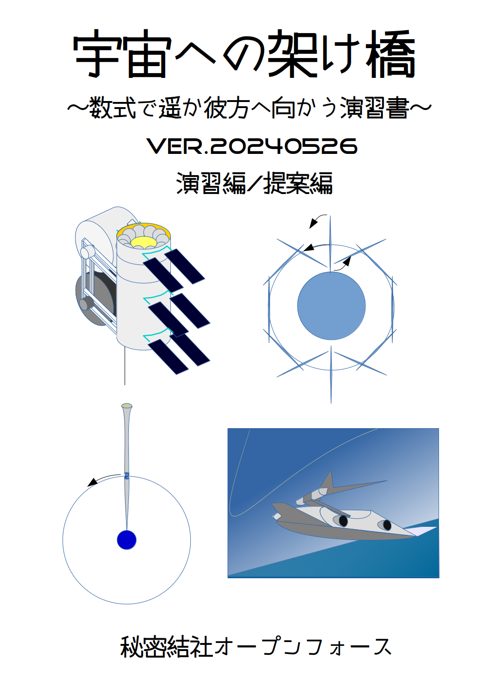

 

 

# 本書の狙い
## 宇宙に行こう
幾多の人々が天界を既に駆けています。共通の言語、数学によって。
時代、政治、思想が異なっても、同じ世界に行くことができます。
いつの日か、異なる星に住む人たちと話をする時、同じように数学による意思疎通が図られるでしょう。

## 本書において
### ブラックボックスをなるべくなくします。
公式をできる限り導き出すようにします。
自分の手でいちから計算していきます。

### 有効数字は3桁

計算の結果は有効数字内に四捨五入します。
また、計算の途中で導き出した数字も同様に扱います。
単位系はMKS単位系を使います。

## 演習編

今の宇宙開発を理解すための基礎的な計算、および提案編の準備としての軌道エレベータやその派生手法を数式を使って理解します。

### 解答

演習の解答は、全ての答えを載せていません。過程や必要なデータは巻末資料やWebで検索したりして調べてみてください。
なお、今回から演習解答を公開します。「あとがき」を参照してください。

## 提案編

今の技術でロケットに代わる安価な宇宙往還システムを考えてみます。演習編のように数式を提示したかったのですが、解析的に解けないところも多く、今回は検討結果の紹介に留めました。

# 目次

- [本書の狙い](#本書の狙い)
  - [宇宙に行こう](#宇宙に行こう)
  - [本書において](#本書において)
    - [ブラックボックスをなるべくなくします。](#ブラックボックスをなるべくなくします)
    - [有効数字は3桁](#有効数字は3桁)
  - [演習編](#演習編)
    - [解答](#解答)
  - [提案編](#提案編)
- [目次](#目次)
- [演習編](#演習編-1)
  - [人類に必要な空間](#人類に必要な空間)
    - [回答？](#回答)
  - [増えすぎた人口](#増えすぎた人口)
    - [回答？](#回答-1)
  - [軌道発電衛星](#軌道発電衛星)
    - [回答？](#回答-2)
  - [宇宙へのコスト](#宇宙へのコスト)
    - [回答？](#回答-3)
  - [宇宙に行く条件は？](#宇宙に行く条件は)
    - [回答？](#回答-4)
  - [第一宇宙速度をすべて位置エネルギーに変換すると？](#第一宇宙速度をすべて位置エネルギーに変換すると)
    - [回答？](#回答-5)
  - [国際宇宙ステーションはどれだけの速さ？](#国際宇宙ステーションはどれだけの速さ)
    - [回答？](#回答-6)
  - [国際宇宙ステーションの位置エネルギーと運動エネルギーの割合は？](#国際宇宙ステーションの位置エネルギーと運動エネルギーの割合は)
    - [回答？](#回答-7)
  - [第二宇宙速度を求めよう！](#第二宇宙速度を求めよう)
    - [回答？](#回答-8)
  - [第三宇宙速度を求めよう！](#第三宇宙速度を求めよう)
    - [回答？](#回答-9)
  - [第二宇宙速度に加速するには？](#第二宇宙速度に加速するには)
    - [回答？](#回答-10)
  - [第三宇宙速度に加速するには？](#第三宇宙速度に加速するには)
  - [第一宇宙速度に加速するには？](#第一宇宙速度に加速するには)
    - [回答？](#回答-11)
  - [重力損失を考える](#重力損失を考える)
    - [回答？](#回答-12)
  - [宇宙へのコスト](#宇宙へのコスト-1)
  - [軌道エレベーターに必要なエネルギー](#軌道エレベーターに必要なエネルギー)
  - [軌道エレベーターの建設コスト](#軌道エレベーターの建設コスト)
  - [軌道エレベータはどこが無理か？](#軌道エレベータはどこが無理か)
    - [回答？](#回答-13)
  - [エレベーターの強度を求める](#エレベーターの強度を求める)
  - [材料の強度](#材料の強度)
  - [エレベータ塔を作る](#エレベータ塔を作る)
    - [回答?](#回答-14)
  - [引張強さ](#引張強さ)
  - [カーボンナノチューブ開発の現在](#カーボンナノチューブ開発の現在)
    - [回答?](#回答-15)
  - [破断長 680km 材料で](#破断長-680km-材料で)
    - [回答?](#回答-16)
  - [テザーの質量](#テザーの質量)
  - [ブートストラップ](#ブートストラップ)
  - [100兆円](#100兆円)
  - [宇宙に行くための難関](#宇宙に行くための難関)
  - [静止軌道を目指さない](#静止軌道を目指さない)
  - [極超音速スカイフック](#極超音速スカイフック)
  - [高度10000km に 200000km 長のテザーを置いた場合](#高度10000km-に-200000km-長のテザーを置いた場合)
    - [回答?](#回答-17)
  - [10000km 長のテザー](#10000km-長のテザー)
    - [回答?](#回答-18)
  - [非同期軌道スカイフック](#非同期軌道スカイフック)
  - [超高空でドッキング](#超高空でドッキング)
  - [非同期軌道スカイフックの実現可能性](#非同期軌道スカイフックの実現可能性)
    - [回答?](#回答-19)
  - [更に問題点](#更に問題点)
  - [ロータベータ](#ロータベータ)
    - [回答?](#回答-20)
  - [Momentum exchange tether 手法のまとめ](#momentum-exchange-tether-手法のまとめ)
- [提案編](#提案編-1)
  - [現在の技術で達成できるもの](#現在の技術で達成できるもの)
  - [Dynamic momentum exchange tether shape 手法](#dynamic-momentum-exchange-tether-shape-手法)
  - [軌道ウインチ](#軌道ウインチ)
  - [問題点1.垂らしたテザーは破断するんじゃないの?](#問題点1垂らしたテザーは破断するんじゃないの)
  - [問題点2.テザーを掴めるの?](#問題点2テザーを掴めるの)
  - [問題点3 キャッチ後どうやって加速するの?](#問題点3-キャッチ後どうやって加速するの)
  - [問題点4 屈曲点で生み出される推力が大きすぎない?](#問題点4-屈曲点で生み出される推力が大きすぎない)
  - [問題点5 屈曲点半径を増大するにはどのようにするの?](#問題点5-屈曲点半径を増大するにはどのようにするの)
  - [問題点6  加速中、破断しない?](#問題点6--加速中破断しない)
  - [問題点7 テザーが振動を起こすんじゃないの?](#問題点7-テザーが振動を起こすんじゃないの)
  - [問題点8 最後はどうなるの?](#問題点8-最後はどうなるの)
  - [問題点9 失われた軌道ステーションの運動量はどう補完するの?](#問題点9-失われた軌道ステーションの運動量はどう補完するの)
  - [問題点10 総質量が重いね! これだったら他の手法がいいんじゃない?](#問題点10-総質量が重いね-これだったら他の手法がいいんじゃない)
  - [WINTLETT 概要](#wintlett-概要)
- [発展](#発展)
  - [発展1](#発展1)
  - [発展2](#発展2)
  - [発展3](#発展3)
  - [発展4](#発展4)
  - [発展5](#発展5)
  - [発展6](#発展6)
- [資料篇](#資料篇)
  - [基本的な数値](#基本的な数値)
    - [重力加速度](#重力加速度)
    - [地球の赤道半径](#地球の赤道半径)
    - [地球の軌道半径](#地球の軌道半径)
    - [平均軌道速度](#平均軌道速度)
    - [1年](#1年)
    - [光の速度](#光の速度)
    - [万有引力定数](#万有引力定数)
    - [地球の質量](#地球の質量)
    - [太陽の質量](#太陽の質量)
    - [静止軌道高度](#静止軌道高度)
    - [音速](#音速)
    - [太陽定数](#太陽定数)
  - [基本的な数式](#基本的な数式)
    - [速度・移動距離・加速度](#速度移動距離加速度)
    - [角速度・半径・加速度](#角速度半径加速度)
    - [ツォルコフスキーの公式](#ツォルコフスキーの公式)
  - [基本的な比較表](#基本的な比較表)
- [東京とびもの学会2024版あとがき](#東京とびもの学会2024版あとがき)
# 演習編
## 人類に必要な空間

立って半畳、寝て一畳という言葉があります。一畳というのは $85\times170 〜 100\times200cm$ですが、計算しやすく$1m \times 2m$ とします。
世界中の人口70億人として、一人あたり2平方メートルに入れるとすると、どのくらいの面積が必要でしょうか。

1. 佐渡ヶ島ぐらい
1. グリーンランドくらい
1. オーストラリア大陸ぐらい

### 回答？

- 佐渡ヶ島　$18,780km^2$
- グリーンランド $2,170,000 km^2$
- オーストラリア大陸 $7,690,000 km^2$

さて、70億人分のスペースは $140億m^2$ですが・・・？

## 増えすぎた人口
「機動戦士ガンダム」では、宇宙世紀という年号が使われています。UC0079というように、Universal Century を略して使われていて、宇宙移民が始まった年を宇宙世紀元年という設定になっています。

UC0000,人口が90億人。
UC0050,人口110億のうち、90億が宇宙へ。

> "地球の周りには巨大なスペース・コロニーが数百基浮かび、人々はその円筒の内壁を人口の大地とした。その人類の第二の故郷で、人々は子を産み、育て、そして死んでいった。 "
> 　
>
> ー 機動戦士ガンダム(劇場版) オープニング

さて、スペースコロニーは直径4マイル x 長さ20マイル で3枚の地上面を持ちます（オニール・島３号案）。
kmに直すと直径6.4 km、長さ32 kmです。

  

スペースコロニーが数百機ということで、仮に500機としましょう。そのうち、90億人が500機に住むとすると、人口密度はどれほどになるでしょうか。計算してみましょう。

### 回答？

先の図のように、円筒の側面の半分は窓なので、陸の面積 S は
$$ (3.14\times6.4\times32/2)=322[km^2]$$
で人口は一基あたり
$$ 9.0\times10^{9}/5.0\times10^2=1.8\times10^7[人] $$
、すなわち 1800 万人です。とすると人口密度は
$$
1.8\times10^7/3.2\times10^2=〔\hspace{10mm}〕[人/km^2]
$$
参考：東京都の人口密度は面積が$2194km^2$で2022年末頃の人口は $1400万(=1.4\times10^7 )人$ 程度で
人口密度は・・・
$$
1.4\times10^7/2.2\times10^3=〔\hspace{10mm}〕[人/km^2] 
$$

ちなみに、50年間で70億人が宇宙に移民するとなると、1日あたり38万人が宇宙に行かないといけません。
羽田空港の利用者が1日17〜19万人。2015年度の渋谷駅1日平均利用者が372,234なので、宇宙港がひとつだけならそのくらいの賑わいになりますね！！
## 軌道発電衛星

先の計算は洒落にならなかったですね。人口爆発分をスペースコロニーで吸収するというのはちょっと非現実っぽいです。
とはいえ、宇宙には月や火星もありますね。また人口を吸収しなくても資源やエネルギーのために宇宙を目指す理由もあります。
ここで、宇宙からエネルギーを賄うとして、 $10km \times 10km$ の軌道発電衛星を考えます。
太陽定数を $ 2kw/m^2 $として、効率10%で地上に送電できるとして、1テラワットを賄うためには太陽発電衛星がどれだけ必要でしょう。

2019年の世界のエネルギー消費量は、169億toe（toe:原油換算トン）でした[^1]。将来200億toe として、その10%を賄うとすれば、太陽発電衛星はどれだけ必要でしょうか。

太陽発電衛星の質量を、１平方メートルあたり、$100g(グラム)$ だとします。$10km \times 10km$の太陽発電衛星の質量はどれだけになるでしょう。

[^1]: 令和2年度エネルギーに関する年次報告（エネルギー白書2021）

### 回答？

$1 toe = 42GJ$ となります。
$1GJ$ は $278kwh$ となるので、$200億toe$ を 1年で均すと26.6テラワットになります。

$10km \times 10km$ の太陽発電衛星の質量は、10000t。

## 宇宙へのコスト

H2Aだと、ブースター4基で4.6トンを打ち上げられ、コスト120億円。
現在開発中の H3 ロケットだと、打ち上げ能力 6.5トンで打ち上げ費用は約 50 億円（最小構成時）。

軌道発電衛星を建設するために、1万トンを宇宙に打ち上げるにはいくらかかるでしょう？

日本の電力会社の最大発電量力は、2019年度で 16500万KW[^2]。全部を太陽発電衛星にすると何トンを打ち上げないといけないでしょうか？？

[^2]: 電気事業のデータベース（INFOBASE 2020）電気事業連合会

### 回答？

日本のお金として、2021年度一般会計予算は約106.6兆円。2020年度の原油輸入額は42.39x10億ドル[^3]。

割に合うでしょうか？

[^3]: 令和２年(2020)資源・エネルギー統計年報(石油) 経済産業省

## 宇宙に行く条件は？

まず、宇宙太陽発電衛星を建設するためには、太陽発電衛星を最低でも人工衛星として成り立たなければなりません。さもなければエネルギーを失って地上に墜落するか、地球重力を振り切って惑星間宇宙に脱出してしまいます。
一度人工衛星になれば、エネルギーはほとんど失わずに地球上の軌道に位置することができます。人工衛星になる最低条件は、地球の大気圏外で第一宇宙速度で周回することです。

第一宇宙速度を求めましょう。

$$
a=r\omega ^{2}
$$

の角速度と加速度の公式に rは地球半径、gは重力加速度、ωは角速度としてあてはめて以下のようになります。

$$
g=r\omega ^{2}
$$

角速度$\omega$と速度$v$の変換は

$$
r\omega=v
$$
となります。さて、ロケットで大気圏外に行くのではなく、ジェット機で大気圏上層まで加速して、最後にちょっとだけ大気圏外で加速するようにしたらどうでしょう？

第一宇宙速度の

マッハに直すとどのくらいでしょうか。
音速は340m/sとなります。

### 回答？

飛行機がジャンボジェットだとマッハ0.9ですね。
軍用機だともっと出せます。F-15などの戦闘機だとマッハ2.5が最高速度ですが、この速度は1分程度しか出せません。持続的に出すとなると例えばXB-70などでマッハ3程度出せるようになります。

## 第一宇宙速度をすべて位置エネルギーに変換すると？

位置エネルギーの公式は $mgh$ となります。
運動エネルギーは $\dfrac {1} {2}mv^{2}$  となります。

### 回答？

$\dfrac {1} {2}mv^{2}$ ということで、単純に $v=7.9$ km/sをこの式にあてはめます。位置エネルギーに変換するには重力加速度gで割ります。そうすると、 $6.24\times10^{7}$ m。
地球の半径が $6.36\times10^{6} m$なので、地球の直径の5倍程度の高さになります。

しかしながら、このくらいだと重力が異なってきます。これだけ離れると重力が弱くなるので、実際にはもっと高い位置に相当することになります。

## 国際宇宙ステーションはどれだけの速さ？

さきほど、第一宇宙速度を求めましたが実際の人工衛星もそのとおりでしょうか？ 国際宇宙ステーションは高度400km程度の軌道です。

  

### 回答？

さきほど、第一宇宙速度を求めたときにつかった半径の値は $r = 6.38\times10^{6}$ でしたが、$400km$ 上空ということで $r$ は $6.38\times10^{6}+4\times10^{5}$ となります。
計算すると、第一宇宙速度より増えるでしょうか？ 減るでしょうか？

## 国際宇宙ステーションの位置エネルギーと運動エネルギーの割合は？

先ほど計算した速度エネルギーと、$400km$ の高さの位置エネルギーはどれだけ違うか計算してみましょう。
位置エネルギーの計算は重力が高度によって変化しますが今回は地表から変化せずとして近似します。

### 回答？

運動エネルギーは上の演習で求めた $ 7.7km/s $ を使い、 
$$
\dfrac {1} {2}m(7.7\times10^{3})^{2}
$$
 。 これと 位置エネルギーとして $mgh$ , $h$ は $400km$ として計算したものを比較します。

## 第二宇宙速度を求めよう！

地上から真上に初速 $v$ で打ち上げた物体は、頂点で止まってその後落ちてきます。
初速 $v$ をどんどん大きくすると、頂点はどんどん高くなります。初速 $v$  がある大きさ $v_{2}$ 以上になると、もう落ちてこなくなってしまいます。
その $v_{2}$ を求めましょう。
なお、ここでは真上に打ち上げた場合としてますが、真横に発射しても、 $v_{2}$ より大きな速度だと地球周回軌道から離れてしまいます。

### 回答？

頂点の位置エネルギーEを求めれば、初速が求まります。

$$
E = \frac{1}{2mv^2}
$$

しかし、頂点は無限遠ですね。なのでここでは点電荷の位置エネルギーの式
$$
U = k(Qq/r)
$$
を思い出して、それを応用します。
点電荷の位置エネルギーは無限遠から距離rまで近づいた時に蓄えられたエネルギーなので、以下の式で地球から無限遠から地球半径Rまで近づいたとしてエネルギーが求まります。
$$
E = G(Mm/R)
$$
それから、地球質量Mと万有引力定数Gをあてはめ、上の式にあてはめて初速が求まります。

## 第三宇宙速度を求めよう！

第二宇宙速度より大きな初速で打ち上げた物体は、宇宙の彼方に行ってしまうのではなく、太陽の回りを廻るようになります。更に初速を大きくしていき、ある速度 $v_{3}$ を超えると、太陽の引力を脱して今度こそ宇宙の彼方にいってしまいます。
その $v_{3}$ を求めましょう。

### 回答？

先の式を使い、
$$
E = G(M_{s}m/R_{s})
$$

ここで、Msは太陽質量、$R_{s}$ は地球の軌道半径です。これを使って速度を求めると、$42.1km/s$ となります。
しかしながら地球の公転速度が $29.8km/s$ あるので、それをうまくつかうと地球の公転軌道からは $12.3km/s$ の速度があればいいことになります。
ただし、地球の地上からは第二宇宙速度分のエネルギーが必要なので、それを足さなければいけません。
それを足すと、$16.7km/s$ となります。
あれ？　何故、$12.3+11.2=23.5km/s$ じゃないのでしょう？？

## 第二宇宙速度に加速するには？

第一宇宙速度で地表スレスレを周回している状態から、第二宇宙速度に加速するには $ 7.9 km/s $  から $ 11.2 km/s $ に $ 3.3 km/s $ 分を加速する必要があります。加速にはいろいろ方法がありますが、ここではオーソドックスにロケット噴射で行おうとします。ロケット噴射は質量のある物体を噴射してその反作用で推進します。
高校物理の範疇での簡単なモデルを考えます。2kg の物体のうち、ペイロードが1kg、プロペラントが1kgとします。通常プロペラントは熱や電気力などを使い、気体やプラズマの状態で連続的に噴出します。しかしながら極端に簡略化して、プロペラントは剛体の固体で、それを一回で噴出して反動力で推進するとしましょう。
例えば、プロペラント $1kg$ を $1m/s$ の加速を与えて後方に一気に噴出すると、ペイロードは前方に $1m/s$ 分の加速を得ます。一方、プロペラント $100g$ を $19m/s$ の力積を与えて後方に一気に噴出すると、ペイロード1kgとプロペラント0.9kg は $1m/s$ 分の加速を得ます。

|使用プロペラント質量|使用プロペラント加速|ペイロード+残プロペラント質量|ペイロード+残プロペラント加速|
|:---:|:---:|:---:|:---:|
|1kg|-1m/s|1kg|1m/s|
|100g|-19m/s|1.9kg|1m/s|
|10g|-199m/s|1.99kg|1m/s|
|1g|-1999m/s|1.999kg|1m/s|
|100mg|-19999m/s|1.9999kg|1m/s|
|10mg|-199999m/s|1.99999kg|1m/s|
|1mg|-1999999m/s|1.999999kg|1m/s|
|0.1mg|-19999999m/s|1.9999999kg|1m/s|

プロペラント加速

これ以上だとプロペラントが光速度に近づいて相対論効果が発生してきますのでひとまずここまでにしておきます。

当然ながら、プロペラントの加速が大きければ大きいほど少量のプロペラントで済み、効率がいいですね。

さて、プロペラントをこのように加速するにはどのようにすればいいのでしょうか？

|方法|上限|上限値の由来|
|:---:|:---:|:---:|
|圧縮空気|340m/s|標準状態の空気の音速|
|化学燃焼1|786m/s|炭素-酸素の燃焼温度のCO2分子速度|
|化学燃焼2|1230m/s|水素-酸素の燃焼温度のH2O分子速度|
|化学燃焼3|3700m/s|水素-酸素の燃焼温度のH2分子速度|
|ばねなどの機械的加速|6000m/s|鋼鉄の縦波速度|

プロペラント加速方法その1

ここで、ロケットの性能指標によく使われる「比推力」という概念を導入します。「比推力」はプロペラント噴出速度を重力加速度 g で割った値です。

|方法|上限|上限値の由来|比推力|
|:---:|:---:|:---:|:---:|
|圧縮空気|340m/s|標準状態の空気の音速|35|
|化学燃焼1|786m/s|炭素-酸素の燃焼温度のCO2分子速度|80|
|化学燃焼2|1230m/s|水素-酸素の燃焼温度のH2O分子速度|126|
|化学燃焼3|3700m/s|水素-酸素の燃焼温度のH2分子速度|378|
|ばねなどの機械的加速|6000m/s|鋼鉄の縦波速度|612|
プロペラント加速方法その1+比推力

|方法|上限|上限値の由来|比推力|
|:---:|:---:|:---:|:---:|
|アーク推進1|637m/s|水銀をアーク加熱で3000℃にした分子速度|65|
|アーク推進2|3410m/s|リチウムをアーク加熱で3000℃にした分子速度|347|
|レーザー熱推進1|2200m/s|アルミニウムをレーザー加熱で5000℃にした分子速度|224|
|イオン推進1|149000m/s|10価キセノンプラズマを 1.5kV 加速|15200|
|イオン推進2|200000m/s|1価マグネシウムプラズマを 5kV 加速|20400|
|イオン推進3|1110000m/s|3価リチウムプラズマを 15kV 加速|113000|

プロペラント加速方法その2

|方法|上限|上限値の由来|比推力|
|:---:|:---:|:---:|:---:|
|原子力推進1|600000m/s|重水素-ヘリウム3ペレットの核融合直後の重水素原子核速度|61200|
|原子力推進2|26800000m/s|ダイダロス計画第2段における核融合推進|2730000|

プロペラント加速方法その3

上記のプロペラント加速は単純計算で、実際にはノズルで増速したり、変換損失があったりしていろんな左右要素が在ります。そうであっても加速に使えるプロペラントは良さそうなものが多くありますよね。どれを使っても、第一宇宙速度から第二宇宙速度に到達するのはそんなに難しくは無さそうです。

では例として、液体酸素-液体水素ロケットを使って第一宇宙速度に達している宇宙船を第二宇宙速度に増速することを考えてみましょう。

水素-酸素の 質量比を 3：1 ぐらいにして完全燃焼から水素を過剰とし、燃焼排気速度を熱運動による速度をノズルで増速して約4,000 m/s とします。

先の簡単な想定では、プロペラントを固体の塊としていっぺんに排出する方法で考えていましたが、実際には気体などを連続的に噴出することになります。その場合、連続的に噴出して最終の速度と残り質量がいくらになるかというのは公式があります。

ツォルコフスキーの公式で、

$$
\Delta V= w\ln \dfrac{m_{0}}{m_{T}}
$$

で、増速分 $\Delta V$ ,  排気速度 $w$ 、初期質量 ${m_{0}}$ , 噴射後の残り質量 $m_{T}$ となります。

この式にあてはめてみましょう。

### 回答？

ツォルコフスキーの公式に増速分 $\Delta V= 3.3km/s$ ,  排気速度 $w = 4000m/s$ をあてはめて変形、

$$
 \dfrac{m_{0}}{m_{T}}=exp \dfrac{\Delta V}{w}
$$

を求めてみましょう。これで求まるのは、1kgのペイロードを第2宇宙速度に増速するためのプロペラントを含んだ増速前の全体質量です。

1kg の何倍のプロペラントが必要でしょうか。

## 第三宇宙速度に加速するには？

惑星軌道から、太陽系脱出速度にするために  $11.2 km/s$  から $16.7km/s$ の差分 $5.5km/s$ を加速するにも第二宇宙速度を得るためのしくみをつかうとそんなに難しくは無さそうです。実はそれだけではなく、惑星軌道からだと月や惑星の引力を使うスイングバイ、太陽風を使うソーラーセイルなどの方法も使うことができ、速度を得るための選択肢が広がります。

スイングバイやソーラーセイルは地球軌道でも使用できますが、利用シーンは惑星軌道上で使うほうが使いでが良くなります。

## 第一宇宙速度に加速するには？

今までの計算では第一宇宙速度から第二、第三宇宙速度に達するのは簡単ぽかったですね。第一宇宙速度に達するのも簡単でしょうか！？ 第一宇宙速度から第二宇宙速度に達するために、3.3km/sの加速のために液体酸素-液体水素ロケットを使って ペイロードの1.28倍の燃料が必要でした。
今回は7.9km/sの加速ですから1.28倍の2倍強のプロペラントがあればいいでしょうか？
計算してみましょう！ 

$$
 \dfrac{m_{0}}{m_{T}}=exp \dfrac{\Delta V}{w}=exp \dfrac{7.9\times10^3}{4000}=7.2 
$$

となります。つまり、1kgのペイロードに7.2kg-1kgで6.2kgのプロペラントが必要ということですね。

実際にはロケットを打ち上げる場所と打ち上げ方向により、地球の自転の速度を打ち上げ速度の一部として利用できます。自転による線速度は赤道で最大になりますが、それでも・・・(自転の効果は計算してみてください)。

以下は一応自転効果なしで計算を進めます。
液体酸素-液体水素ロケットで第一宇宙速度を得るためには結構プロペラントが必要で、なんだかつまらないですね。

では、比推力の大きいキセノンイオン推進エンジンを使ったらどうでしょう！

|方法|上限|上限値の由来|比推力|
|:---:|:---:|:---:|:---:|
|イオン推進1|149000m/s|10価キセノンプラズマを 1.5kV 加速|15200|

プロペラント加速方法その4

計算してみると、

$$
 \dfrac{m_{0}}{m_{T}}=exp \dfrac{\Delta V}{w}=exp \dfrac{7.9\times10^3}{149000}=1.05
$$

つまり、1kgの質量を軌道に上げるのに、50g のプロペラントしか使わないということです。イイですね！ ・・・ いやいや、そうはいきません。
実際にはイオン推進エンジンなどは、エンジン自体の質量がかなりあり、それに比べて推力はホンの少ししか出ません。無重力状態で少しずつ加速する、すなわち軌道上から第二宇宙速度や第三宇宙速度を獲得するのに適したエンジンです。地上の速度ゼロ状態から第一宇宙速度に達するまでは、垂直打ち上げの場合ロケットの推力で発生した加速度から地球の重力が差し引かれてしまうので、とにかく加速度を g の何倍も稼がなければなりません。そのためにはエンジン全体の重量、プロペラントの重量、ペイロードの重量に比べ数倍以上の加速度を得ることが必要となります。

|方法|上限|上限値の由来|比推力|
|:---:|:---:|:---:|:---:|
|圧縮空気|340m/s|標準状態の空気の音速|35|
|化学燃焼1|786m/s|炭素-酸素の燃焼温度のCO2分子速度|80|
|化学燃焼2|1230m/s|水素-酸素の燃焼温度のH2O分子速度|126|
|化学燃焼3|3700m/s|水素-酸素の燃焼温度のH2分子速度|378|

プロペラント加速方法その1(再掲)

実は、ここで比推力の小さい化学燃焼が必要になってきます。分子量の大きなプロペラントは、速度が小さくても運動量が大きくなります。
実は先程液体酸素-液体水素で計算した以下の数字も、

$$
 \dfrac{m_{0}}{m_{T}}=exp \dfrac{\Delta V}{w}=exp \dfrac{7.9\times10^3}{4000}=7.2 
$$
重力損失が無い状態の式で、実際には軌道速度に至るまでの時間がかかればかかるほど、重力に対抗するプロペラントが余計に必要となります。

では、例えば同じ3000℃に加熱された CO2 と H2 では 786 m/s と 3700 m/s の違いがありますが、これを運動量に直すとどれだけの違いが出るでしょうか？

### 回答？

CO2 の分子量は 44 です。H2の分子量は2ですね。
同じ1kg のガスを 3000℃ に熱しても、 786 m/s と 3700 m/s の違いがあり5倍の違いがあります。しかしながら 分子量が22倍違うので、分子量をかけ合わせると、推進力はXX倍CO2の方が勝ることになります。

## 重力損失を考える

人間が耐えられるGは5G程度までと言われています。スペースシャトルは3G程度の加速で打ち上げられます。仮に3Gで打ち上げるとなると、ロケットの推進エンジンは4G加速分の推力が必要となります。

さて、3G加速で垂直に上昇したとしたら、81秒で高度100kmまで到達します。秒速2.4kmにしか達していませんが、ここでエンジン推力がゼロだとしても、弾道飛行で500秒ほど大気圏外に位置できます。この500秒の間に横向きに7.9km/sの加速ができるようになればいいです。そのためには1~1.5G加速程度で十分事足ります。

では、このように打ち上げをする場合、どれだけのプロペラントが必要になるでしょう？

### 回答？

500秒の間に横向きに7.9km/s の加速、その前に

81秒で重力に反対向きに3G加速ということは、エンジンにとっては4G加速のための推力を81秒出しているということになります。無重力でもし4G加速を81秒行ったとすると3.2km/sの加速を得ます。その後、横向きに7.9km/s の加速が必要になるので 合計 11.1km/s の加速が必要となります。ツォルコフスキーの公式で、先程の液体酸素・液体水素エンジンを使うと考えると、

$$
 \dfrac{m_{0}}{m_{T}}=exp \dfrac{\Delta V}{w}=exp \dfrac{11.1\times10^3}{4000}=... 
$$

これはつまらないですね！ もう、第一宇宙速度を得るためだけにもうほとんどプロペラントになってしまいますね！

## 宇宙へのコスト

先の計算で、化学燃焼式ロケットだと第一宇宙速度を得るためだけにいっぱいいっぱいということがわかりました。100トンのロケットで、プロペラントが90%以上を占めていて、エンジン、フェアリングなどを除く純粋なペイロードは5% 未満です。更に静止軌道にに乗ったり第2、第3宇宙速度に乗るとなるとペイロードは1%未満となるでしょう。
もっと比推力の大きいエンジンは、ほとんどが大気圏外でなければ使えません。唯一重水素-ヘリウム3ペレットの核融合ケットが大気圏外で使えそうですが、実用化には程遠そうです。
これだと宇宙へ行くコストは全く安くなりそうにありません。もっと、抜本的なコストダウンの方法はないでしょうか。

## 軌道エレベーターに必要なエネルギー

ここで、軌道エレベータを考えてみます。静止軌道から地上にエレベーターを通します。静止軌道は24時間で地球を回る軌道なので、地上に通じたエレベーターは地球上の赤道のある地点に固定できます。静止軌道に昇るエレベーターは、軌道エレベーターの例えばリニアモーターで引き上げます。それに使うエネルギーは、エレベーターの下りで発電できます。損失を考慮に入れなければ、昇る質量と下る質量が同じならエネルギーゼロで運用ができます。実際には損失がありますが、軌道上にありあまる太陽エネルギーを容易に利用できるでしょう。

これだと、建設してしまえば宇宙に行くコストはかなり安くなるのではないでしょうか。

## 軌道エレベーターの建設コスト

一説には10兆円ということが言われています。しかしながらそれは技術の裏付けがあるものではなく、素材自体まだ人類には手にしていないものです。10兆円という金額を出したとしても、建設に乗り出すことができない以上絵に書いた餅と言わざるを得ません。

## 軌道エレベータはどこが無理か？

静止軌道と地上を結ぶ構築物に耐える強度の材料が存在しないことです。

まず、静止軌道の高さがどれだけか計算してみましょう。

### 回答？

角速度と加速度の公式
$$
a=r\omega ^{2}
$$

で角速度ωが $ 2π/day $, $ r $が軌道半径、$ a $ は重力加速度としてあてはめます。重力加速度は地球から離れているので $ r $ が増えると減少し以下のようになります。

$$
a=g(\dfrac{r_{e}}{r})^2
$$

ここで、${r_{e}}$ が地球半径です。

式を当てはめて、

$$
r\omega ^{2}=g(\dfrac{r_{e}}{r})^2
$$

ここから変形して

$$
r=\sqrt[3] {g(\dfrac{r_{e}}{\omega })^2}
=\sqrt[3] {9.8(\dfrac{6.38\times10^3}{7.2\times10^{-4} })^2}
=...
$$

となり、求まった値から6430kmを引くと静止軌道高度になります。

これはかなりの長さになりますね！

## エレベーターの強度を求める

高さが求まりましたので、それを元にこの図のようにエレベータは設置できるかどうか考えてみましょう。

地球から、36000km の高さの大きなビルディングを建設するのですね。

この場合、エレベーターの下部分の材料が、上の階を支えられる圧縮強度があることが必要になります。

## 材料の強度

地上建造物の材料でよく使われているものの強度を調べてみました。

||密度(g/cm3)|圧縮強度(MPa)|引張強度(MPa)|出典|
|:---:|:---:|:---:|:---:|:---:|
|490級鋼材 |(7.9)|490-625|625-|JIS G 3112|
|木材|0.53|41|1300|[^4]|
|コンクリート|2.3|30|10|[^5]|
|鉄筋コンクリート|2.245|220|220|span class=pin>[^6]|
|超高強度繊維補強コンクリート|2.45|150|7|span class=pin>[^7]|

建築材料の強度

[^4]: 強度データは直交異方性材料としての木材の弾性および強度 沢田稔 材料12巻 (1963) 121 号 よりアカマツデータから計算

[^5]:度データは国土交通省北海道開発局 https://www.hkd.mlit.go.jp/ky/kn/dou_ken/ud49g70000001ly2-att/splaat0000003vaf.pdf 

[^6]: 強度データは 第2章 コンクリートと鉄筋の性質 畑中 重光  https://mie-u.repo.nii.ac.jp/index.php?action=repository_action_common_download&item_id=10134&item_no=1&attribute_id=17&file_no=1&page_id=13&block_id=21 
より SD300 鉄筋使用のデータ

[^7]:株式会社エスイーESCON超高強度繊維補強コンクリート

## エレベータ塔を作る
  

これから、どれだけの高さの塔が作れるか考えてみます。
単純に、どれだけの高さまで自重に耐えられるかどうかを

$$ h = (圧縮強度  )/ (密度*重力加速度*1000)$$
で計算し、これを長さの次元を持つ「材料高」という単位とします。この1000は、密度をMKS単位系に直すためのものです。

|材料|材料高(m)|
|:---:|:---:|
|490級鋼材 |6330-8070|
|木材|0.53|41|7890|
|コンクリート|1330|
|鉄筋コンクリート|10000|
|超高強度繊維補強コンクリート|6250|

圧縮強度から求めた材料高

最も成績の良いものでも 10km  程度になってしまいますね。

この数値は、単純に棒のような形にして立てたときに 10km まで支えることができるということです。では、形状を変えて根元を太くして強度を上げるとどうでしょうか。
単純に直線錐形状とするだけでも、3倍の高さを稼ぐことができます。
より最適化した形状としては、頂上から対数的に断面積が大きくなる形状となります。この形状は均一な重力場を想定するものですが、厳密には高さが高くなるに従って重力が弱くなり、遠心力が働くので対数形状よりもっと高く伸ばしたようになります。しかしながらここで計算する対象はまだ数十km程度なので、均一な重力場で近似して差し支えありません。
さて、実は圧縮強度が小さくても対数的に末広がりの形とすると高さの制限は無くなり、理論的にはいくらでも高く積み上げることができるようになります。とはいえ実現できるかどうかは別問題です。仮に1kmごとに2倍の断面積を持つ形状で考えてみましょう。頂上で1平方メートルの断面積を持つものは48km下ると根元が地球半径を超えてしまいます。
なので現実的な広がりに収めるためには、それなりの強度を持つ材料が必要となります。では、鉄筋コンクリートで作成した場合は、根元の大きさはどうなるでしょうか?

頂上で1平方メートルに圧縮限界の荷重がかかった鉄筋コンクリートの場合、h/ρ  の高さごとに e 倍の断面積となります。
$h=10000$, $ρが2.245$ なので$ 4.45km$ ごとに2.72倍となる・・・

### 回答?

仮に、頂上が0.01平方メートルで48400トンの荷重限界として、
890kmの高さで断面積が[　　　　　]平方メートルとなります。
円柱とすると、根元は直径2.4kmの円柱となります。ここらへんが限界でしょうか。

一般的には高度100km 以上を宇宙としていますから、
宇宙には十分到達できていることになります。しかしながら静止軌道である地表からの高度36000kmに比べると0.3%程度しか無く、全然ダメですね。

464MPa の強さを持つコンクリートもありますが[^8]、このくらいでは焼け石に水で、抜本的なところから考え直しが必要です。

[^8]: 「世界最高強度を達成するPFC（無孔性コンクリート）の開発」
https://www.taiheiyo-cement.co.jp/rd/pfc/outline/index.html

## 引張強さ

今までは積み上げで塔を作る計算をしました。しかしながら材料の強度としては、実は引張強度が大きな材料を探すのが賢明です。

| 物質| 引っ張り強度(MPa)| 密度(g/cm3)| 比強度(kN·m/kg)|破断長(km) |
|:---:|:---:|:---:|:---:|:---:|
|コンクリート	|10	|2.30	|4.35	|0.44	|
|ステンレス鋼304	|505|	8.00|	63.1|	6.4|
|オーク材	|60	|0.69	|86.95	|8.86|
|アルミニウム合金	|600	|2.70|	222	|22.65|
|Scifer steel wire	|5500	|7.87|	698	|71.2|
|ガラス繊維	|3400	|2.60	|1307	|133	|
|ケブラー	|3620	|1.44	|2514	|256	|
|炭素繊維東レ T1100G	|7000|	1.79|	3911|	399|
|カーボンナノチューブ（不確実）|	62000	|0.037–1.34	|46268–N/A	|4716–N/A|

引張強度表[^9]

[^9]: Wikipedia 日本語版「比強度」ページ中の「比強度・破断長の値」 2023年8月1日 https://ja.wikipedia.org/wiki/比強度

引張強度は圧縮強度と比べて数十倍以上の値の物質を使うことができます。
引張材料を使う場合、宇宙軌道からワイヤーをぶら下げる形になります。

このワイヤーについて、以下「テザー」と呼んでいくことにします。

静止軌道のステーションからテザーを地球に降ろしますが、その重みに対抗するために、反対側にカウンターウェイトを置き、遠心力で釣り合いを取ります。図では小惑星をカウンターウェイトとしています。

先程は、どれだけの高さに圧縮材料が耐えられるかを
$$ h  = (圧縮強度  )/ (比重*重力加速度*1000) $$
で計算しましたが、同様に引張材料の強度はどれだけの長さの自重に耐えられるかを

$$ h =  (引張強度  )/ (比重*重力加速度*1000) $$

で計算します。

これを「材料高」 に対して「破断長」とし、同じ h の記号で表すことにします。

均一な重力場では、破断長が36000km あれば静止軌道まで届くことになります。しかしながら先に説明したように、高さが高くなるに従って重力が弱くなり、遠心力が働くので実際には破断長は4960kmあれば静止軌道まで届くことになります。

##  カーボンナノチューブ開発の現在
しかしながら、表の破断長はカーボンナノチューブぐらいしかないですね。カーボンナノチューブの実現可能性はどのくらいでしょうか???

### 回答?

最近の話題で、以下のような方法で長く撚った糸状のものが得られたそうです[^10]。

  

[^10]: 出典：住友電工テクニカルレビュー　第199号
「新規成長法による超高強度カーボンナノチューブ線材」（2021年7月）https://sumitomoelectric.com/jp/sites/japan/files/2021-07/download_documents/J199-11.pdf

撚りを行うことで、1m 程度のものが得られ、また集合線状態において引張強度が 10GPa  を超えたそうです。

論文にしたがって樹脂を含浸した集合線を考え、仮に引張強度 10GPa 密度を1.5とすると、

| 物質| 引っ張り強度(MPa)| 密度(g/cm3)| 比強度(kN·m/kg)|破断長(km) |
|:---:|:---:|:---:|:---:|:---:|
|樹脂含浸CNT集合線|	10000	|1.5	|6670	|680|

実現したカーボンナノチューブ材料の強度

破断長は4960kmに全く届きませんが「炭素繊維東レ T1100G」に比べ7割アップしています。
破断長4960kmを超える材料の開発は全く未知数ぽいですが、この程度なら期待しても良さそうです。

## 破断長 680km 材料で

1975年に発表された、軌道エレベーターの古典的な論文を見つけました。
「The orbital tower: a spacecraft launcher using the Earth’s rotational energy」
  

著者ジェローム・ピアソンは現在も宇宙企業スターテック社を経営していて、その Webサイトで公開されています。
( http://star-tech-inc.com/papers/tower/tower.pdf )

この論文中で、パラメータ h (破断長=特性高) とテーパー比 As/A0 の関係は以下のように示され、

この式を使って破断長680kmの樹脂含浸CNT集合線で軌道エレベータを作成した場合、テーパー比は1450となります。

ちなみに、表11に示した破断長399の「炭素繊維東レ T1100G」だとテーパー比はどうなるでしょうか?

### 回答?

(すごい値になりますね。桁が2桁異なってしまいます。)

## テザーの質量

地表で $10\times10^{-3}m^2$ すなわち断面積 1平方cm のテザー1本だけの構造で考えてみます。これでも、102 トンを持ち上げることができます。
このテザーが高度が高くなるほど断面積が大きくなり、静止軌道上では0.145平方メートルということになります。このときのテザーの全体重量は20万トン〜30万トンぐらいになります。
うーん、宇宙に30万トンを輸送!?

また、先にアンカーとして小惑星を挙げました。しかしもし小惑星が使えない場合はテザーを長く延ばしてその遠心力をアンカーの代わりに使うことになります。先の論文の図を引用すると、

このような長い構造を、テーパー比1 で考えたとしたら質量は、

$$ (150328km-6378km)\times10^3\times 1\times10^-4\times 1.5\times10^3 = 21600トン$$ 

テーパー無しでもかなりの質量です。テーパー比率1450だと、全体では1000万トンぐらいになりそうです。

##  ブートストラップ

先の試算では、必要なテザーを全部ロケットで運ぶというのはかなり無理ぽく、うまいやりかたを考える必要があります。

吊橋の建設でエアスピニングという工法があります。吊橋のワイヤを一度にかけるのではなく、まず細いワイヤを1本だけ通し、それを伝って2本目、3本目のワイヤをかけて補強していく方法です。

同様に軌道エレベータも最低限のテザーを地表に降ろし、それを伝って地表から登っていきながら補強するという方法をとることができます。

仮に、最初のテザーが地表で1平方ミリメートルの断面積を持ち、1020kg を持ち上げることができるものとすると・・・静止軌道上の断面積は静止軌道上の断面積は14.5平方cmとなります。
初期テザーの全体重量は200トン〜300トン。

## 100兆円
これを安いロケットで打ち上げるとして Falcon Heavy で10回分。打ち上げ費用は15億ドル。打ち上げ費用だけなので、材料費や地表から登っていくクライマーの費用、地表や軌道上の基地を作成する費用、などをこれにプラスしていくことになります。

さて、全体はいくらになるか・・・
軌道エレベータの構想に取り組んでいる大林組の試算では、駅やケーブルの建設費を10兆円とみつくろっています。[^12]。

[^12]: 株式会社大林組プレゼンテーション資料  https://www.soumu.go.jp/main_content/000585155.pdf

この金額は 150GPの強度を持ったものです。安全計数をちゃんと2にしたりしてます。
初期テザー20t にしているので安くなりそうですね。
本書では初期テザーの必要質量のがその10倍ぐらいになっています。コストも10倍ぐらいにはなりそうです。

## 宇宙に行くための難関

CNT を使わずに現在、または近い技術で軌道エレベータを作るのはだと、ちょっと厳しそうですね。
100兆円の費用はエレベータ建設をせずとも Falcon Heavy  を400回以上打ち上げることができ、宇宙に2万5千トンを打ち上げることができるてしまいます。軌道エレベータが完成したら運用費用は安くなるとしても、初期投資が大きすぎるかな!

## 静止軌道を目指さない

軌道エレベーターは36万kmもの高度の建造物を作らないといけないのですが、宇宙に行くためにはそれほど高い高度は必要ありません。先に述べたように、第一宇宙速度さえ得てしまえば、そこからトルクの小さくても比推力の大きなエンジンを使ったり、スイングバイを行ったりして工夫の余地はたくさんあります。第一宇宙速度を得るためには高度100km程度で空気抵抗がある程度無視できる状態にまで昇ることができればいいのであって、高度36万kmを目指さなくても良い方法があるはずです。

静止軌道はGEOと呼ばれます。対して、GEOより一段低い軌道を中軌道(MEO)と呼ばれていて、2,000 kmから36,000 kmまでの軌道を指します。
更に低軌道を地球低軌道 (low Earth orbit、LEO) と呼び、地球表面からの高度2,000km以下の軌道を指します。

GEOでなければ、簡単な方法があるでしょうか?

軌道エレベータはテザーを使いますが、同様にテザーを使ったシステムのうち、よく議論されているものとして、以下のようなものがあります。
 
 
- 極超音速スカイフック 
- 非同期軌道スカイフック
- ロータベータ

これらは軌道エレベータも含めて、Momentum exchange tether というカテゴリのものとなります。
言葉は様々な意味で使われているので、  同じ名前が別の意味で使われていたりしますが、本書ではこのリストの言葉で統一します。

## 極超音速スカイフック

静止軌道に重心を持つものだと、地表から36000km の高さまで伸ばさないといけません。
しかしながら静止軌道にこだわらずに軌道エレベータと同じようなものを作るとすると、もっと条件は緩和されます。

## 高度10000km に 200000km 長のテザーを置いた場合

例えば地表から10000km  のところに重心を持つものだと、重心での重力加速度は
$$
\begin{align*}{a = g(\dfrac{r_{e}}{r})^2=9.81(\dfrac{6.38\times10^6}{6.38\times10^6+1.00\times10^7}) ^2 \\
 =1.49
}\end{align*}
$$
角速度と加速度の公式に当てはめて
$$
a=r\omega ^{2}\\
1.49=(6.38\times10^6+1.00\times10^7)\omega ^{2}\\
\omega=\sqrt{\frac{3.82}{(6.38\times10^6+1.00\times10^7)}}=\sqrt{2.33\times10^{-8}}=1.52\times10^{-4}\\
$$

本来は、重力の変化や遠心力による補正がありますが、今回は簡単にこの計算で済ませてしまいます。

地表付近の速度はどれだけになるでしょう?

### 回答?

$$
v= r_0\omega = [　　　　]
$$

地球時点の線速度が$4.63\times10^2$なので差し引き$5.06\times10^2$
マッハ1.5程度となります。極超音速ではないですが、自転しないスカイフックをまとめて「極超音速スカイフック」と呼んでしまうことにします。

これを実現するためには、先程の樹脂含浸CNT集合線を使ってテーパー比500ぐらい。テザー地球側末端が1平方mm の断面積を持つとして、重心位置での太さ500平方mm、
テザー全質量は5000トン前後となります。

## 10000km 長のテザー

先のはちょっと重たすぎかな! もうちょっと短いものとして、地表から5000km
のところに重心を持つもので計算し直してみましょう。

### 回答?

重心での重力加速度は
$$
\begin{align*}{a = g(\dfrac{r_{e}}{r})^2=9.81(\dfrac{6.38\times10^6}{6.38\times10^6+5.00\times10^6}) ^2 \\
 = [　　　　]
}\end{align*}
$$
角速度と加速度の公式に当てはめて
$$
a=r\omega ^{2}\\
3.08=(6.38\times10^6+5.00\times10^6)\omega ^{2}\\
\omega=\sqrt{\frac{3.08}{(6.38\times10^6+5.00\times10^6)}}=\sqrt{27.0\times10^{-8}}= [　　　　]\\
$$

地表付近の速度は
$$
v= r_0\omega =  [　　　　]
$$

地球の自転を引いて $2.85\times10^3$ 、マッハ8.4 !

樹脂含浸CNT集合線を使ってテーパー比300ぐらいで、テザー地球側末端が1平方mm の断面積を持ち
重心位置の断面積が300平方mm テザー全質量は1500トン前後です。

高度10000km だとテザーが重くなりすぎ、高度5000kmだと末端速度が大きすぎました。

## 非同期軌道スカイフック

先の極超音速スカイフックでは、テザーの地球側末端が大気中だと空力加熱を受けるので、100kmよりも上におかないといけません。

高度をもっと低くするためには、末端速度をもっと下げる必要があります。テザーを自転させて地表との相対速度を小さくしてみます。

仮に、200kmの全長のテザーを高度230km におき、100秒で1回転するとするとどうなるでしょう。

この程度だと重力は変わらないとして近似してみます。 テザー末端の線速度6.28km/s となり、テザー重心の移動速度7.9km/s  との差1.5km/s 、赤道の自転速度0.46を引いて1.0km/s マッハ3ぐらいとなります。末端のGは 40.2G となります。

なのでテザー末端面積を40平方mm とし、テーパー比200ぐらいで、重心で8000平方mm 、テザー全体は 2000 トンぐらいです。

全長が極超音速スカイフックよりずっと短いにもかかわらず、テザー総質量が小さくなっているわけはないことは、遠心力に耐えるためにテザーを太くしないといけないからです。

テザーをもっと大きくして、自転速度を遅くしてみます。

800kmの全長のテザーを高度410kmにおき、400秒で1回転してみます。

末端のGは10Gです。

テザー末端面積が10平方mm とし、樹脂含浸CNT集合線を使った場合テーパー比率80ぐらいで、重心で800平方mm,
テザー全体は800トンぐらいです。

高度10km, マッハ3で移動する先端に、航空機で近づきドッキングし、宇宙に引っ張ってもらいます。

## 超高空でドッキング

ロケットを使わずに、航空機で発進すればいいのでこのやりかたは安くなるはずではないでしょうか!

超音速・超航空で航空機からカーゴを切り離すシステムには過去に似た実績があります。M-21から発射されるD-21ドローンです。

  

SR-71のドローン母機バージョンであるM-21から、無人ドローンD-21を約マッハ3で切り離します。
しかしながらこのシステムは成功すること無く、事故でM-21の墜落事故も起こして、その後D-21はB-52からの発進に切り替えられました。
M-21 の元となったSR-71 も、運用が高額すぎるということで衛星のみの運用となりました。

このシステムは1960年代のシステムですが、同様のシステムが生まれていないことを考えると超音速での受け渡しはかなり無理がありそうです。

## 非同期軌道スカイフックの実現可能性

超音速での受け渡しは無理があるということで、亜音速で考えてみます。
亜音速でのドッキングの事例として、空中給油があります。

![プローブアンドドローグ式の空中給油[^11]](images/image-16.png)

[^11]:

File:Basket Case MOD 45147014.jpg This file is licensed under the Open Government Licence version 1.0 (OGL v1.0).
Attribution:Photo: Cpl Heidi Cox RAF/MOD

空中給油システムは時速500km程度が多いそうです。
最大能力的にどのくらいかというのは明確には分かりまんが、マッハ0.9前後でもなんとか可能であるという推測で論を進めます。

このくらいの速度をターゲットとして、テザーをもっと大きくしてみます。地球の半径の半分の、3190kmの全長のテザーを高度1600kmぐらいにおき、1560秒で1回転してみます。、自転速度を遅くしてみます。パラメータを計算してみましょう。

### 回答?

- この高度での軌道速度は [　　　　]
- テザー末端の線速度が[　　　　]
- 赤道の自転速度[　　　　]
- 差し引き[　　　　]
- 末端のGは[　　　　]
 
これだと地球の重力とあわせても人間が耐えうる範囲ですね。
速度も時速に直すと684kmで、空中給油している速度と近いですね!

樹脂含浸CNT集合線を使った場合、テーパー比率200ぐらいで、テザーの末端面積を仮に5平方mm とすると重心で1000平方mm,
テザー全体は4800トンぐらいです。

かなりの質量ですね!

## 更に問題点

この末端のGが2.6Gということは、鉛直方向の加速度が2.6Gあるということで、2.6Gで上下するテザーをキャッチしないといけないということです。
空中でキャッチするのが難しそうなことを考えると、もう少し難易度を下げないと難しそうですね。

これは気球で垂直にあげたケーブルをキャプチャし、地上の人間を回収するシステムの写真です。どれだけうまくいったのかはわかりませんが、似たものとして偵察衛星フィルム回収システムもあり、こちらは結構回収に失敗していることから、このようなものは難しそうです。

また、テザーをキャッチしたあとはテザーを伝って登っていくようにになりますが、モード変更が必要なシステムも、難易度が高くなりそうです。

登らずに、つかまっているだけでも適当な場所で放り出せば第一宇宙速度の2倍を得ることができるので、それを利用するという考えもありますが、これで得られる速度は第3宇宙速度を超えてしまうので、用途は限られそうです。

## ロータベータ

先の非同期軌道スカイフックでは、相対速度を下げるためにテザーを自転させました。しかしながら空中でのドッキングは色々問題がありそうです。いっそ相対速度をゼロにしたら地上でペイロードの受け渡しができるでしょうか。うまくいけば観覧車に乗るみたいに搭乗できるかも知れませんね!

資料によっては、相対速度をゼロにするものを、非同期軌道スカイフックとして紹介しているものもありますが、本書では自転するものを非同期軌道スカイフック、そのなかで相対速度をぜろにするのをロータベータ(Rotovator)として区別します。

先の非同期軌道スカイフックでは、テザー末端で10G とか40Gとかになりましたが、今回は観覧車に乗るように人間が乗れるようにするために、もっと少ない遠心力で考えてみます。

このような、地球の直径と同じだけの長さを持つものを、計算してみましょう。

### 回答?

重心位置は地上から[　　　　] 。重力加速度は $g_0/4$ で[　　　　]。公転速度は
$$
a=r\omega ^{2}\\
2.45=(6.38\times10^6+6.38\times10^6)\omega ^{2}\\
\omega=[　　　　]
$$

地表付近の速度は
$$
v= r_0\omega = 2.79\times10^3
$$

地球の自転分を差し引いて $2.33\times10^3$ 。
そしてこの自転でこの速度を線速度として自転するとすると、末端[　　　　]の遠心力が働きます。

テザー末端面積を1平方mm とし、樹脂含浸CNT集合線を使ってテーパー比400ぐらいで、重心で400平方mm, テザー全体で2500トンぐらい。
先の魅力ない非同期軌道スカイフックより重たいのですが、それでも飛行機で高速度高空でドッキングするよりも簡単、受けるGも小さいのでその点はかなり魅力的です。

しかしながら軌道エレベータの初期テザーの全体重量は200トン〜300トンと比べると重いので、これなら軌道エレベータを作ったほうが良くないかなということになります。

## Momentum exchange tether 手法のまとめ

今までの試算は、仮のパラメータですが、それから出してきた結果を比較してみました。

|提案手法|軌道高度|自転|地表との相対速度|末端高度|エアスピニング工法|破断長680kmでの初期テザー質量(t)|初期テザー質量(t)|
|:---:|:---:|:---:|:---:|:---:|:---:|:---:|:---:|
|軌道エレベータ|GEO|なし|0|0|OK|1000万|200〜300|
| 極超音速スカイフック|MEO|なし|音速〜|100km〜|?|5000,1500|?|
| 非同期軌道スカイフック|LEO|あり|超音速〜|20km〜|?|2000,800,4800|?|
| ロータベータ|MEO|あり|0|0|?|2500|?|

4つの手法の比較

エアスピニング工法を使えば、初期テザーの質量を小さくすることができますが、軌道エレベータ以外は様々な擾乱をどう評価すれば良いか見通せないため「?」としました。

この表では今回試算した値で比較してみましたが、パラメータのとり方によってはうまいやり方ができるかも知れません。計算を試してみてください。

# 提案編 

## 現在の技術で達成できるもの
軌道エレベーターは現在、あるいは射程内に捉えている技術を使って実現はできそうですが、コストがかかりすぎることがわかりました。

更に軌道エレベーター以外の Momentum exchange tether 手法として、以下を検討しました。

- ロータベータ
- 極超音速スカイフック
- 非同期軌道スカイフック

しかし条件がかなり緩和されるものの技術的困難さでの使いでの悪さや、コスト的にまだ検討が必要ということがわかりました。

上記はカーボンナノチューブなどを使わなくても実現の可能性が高い技術を元にして検討しましたが、改めて、使える技術を挙げてみます

- 化学ロケット
- 炭素繊維
- セラミック耐熱タイル
- 空中ドッキング(亜音速)

こういったものをうまく組みあせて、解決できないでしょうか?

## Dynamic momentum exchange tether shape 手法

今までの手法はテザーの変形が行われない、あるいは変形するとしても自転ぐらいでした。テンションでまっすぐである前提でした。

しかしながらテザーは屈曲したり振動したり、伸縮したりするできますね。このような要素を入れると、別のアプローチができます。

これは深センの公園での鞭のパフォーマンスです。元々は動画で撮影したもので、振り回すたびに破裂音が聞こえます。この破裂音は空中で発生していて、これは鞭先端のベーンが音速を超えたときに出る衝撃波です。
手元の手首の速度は100km/s を出すのも難しいのに、なぜ先端は音速を超えることができるのでしょう。

力学的には、鞭は無限の関節を持つ振り子として考えることができます。複数の関節を持つ振り子で最も簡単なものは二重振り子です。単純な二重振り子でも、挙動は予測が困難で先端はカオス的な動きをし、速度がゼロに近づくときもあれば著しく速度が高まるときもあります。

このような力学は手元の少しの動きを先端で増幅することができます。例えば、軌道ステーションからテザーを鞭のように使って先端を軌道速度まで達することは可能でしょうか?

上記の例はあくまで一例ですが、いままでの検討と考え方の異なるものとして思考を進めてみましょう。
このようなやりかたはテザー自体の形状を変化させながら運動量をやりとりする方法なので、新たに Dynamic momentum exchange tether shape と名付けることとします。

## 軌道ウインチ

まず、最初のモデルとしてLEO軌道からウインチのようにテザーを垂らして地表高度から曳くことを考えてみます。

LEOは 100kmから2000km程度ですが、100km〜200km程度の超低高度の衛星軌道からなら地表にテザーを下ろせば破断長を超えずに地表に届くでしょうか? 

では仮に鋼鉄ワイヤで検討してみましょう。鋼鉄の破断長は60kmなので60kmより下ろせば切れてしまうかな! しかしながら鋼鉄ワイヤも衛星軌道と同様に軌道速度を得ているので、静止軌道からまっすぐ下ろすのとは違って重力は働かず、100km〜200kmの長さを展開することができます。

しかしながらこれだと極超音速スカイフックと変わらないですね。軌道が低い分、ランデブー相対速度が大きくなってしまいます。
それを解消するために非同期軌道スカイフックではテザーを自転させていましたね。しかしながら軌道ウインチではテザーを自転させずに考えてみます。

このような施設を軌道上に考えてみます。

白いドラムが直径50m  で、1000km のテザーが巻き付けられているとします。

この軌道上のステーションから、テザーを図のように地表に垂らしてみます。テザー先端は大気に吹き流されます。

テザーは大気により減速し、図に示した時点で、テザー先端は地表に対して亜音速の0.3km/s にまでなっているとします。

このようなテザーを掴めるキャプチャーを装着した航空機型のシャトルを考えます。

航空機のドッキングは、先に論じたように超音速だと技術的に困難が発生しそうですので亜音速で考えましょう。
シャトルのドッキング時の速度は0.3km/s (1080km/h) でマッハ0.9ぐらい。 地球自転の速度も併せて、0.76km/s となります。

さて、ドッキングした後はそのまま引っ張り上げれば・・・

この案をまとめると、以下のようになります。

- 高度400km程度の軌道上の母艦
- テザーを地上に向けて降ろす
- テザー先端の軌道が地上に接する
- 宇宙往還機がドッキング
- テザーで引っ張り上げる

しかし、そんなにうまくはいかないですね。いろいろ問題があります。しかしながら、丹念に検討してみるとうまく問題が解決できそうです。
計算していきましょう。

## 問題点1.垂らしたテザーは破断するんじゃないの?

軌道が400kmですから、そこから直線に垂らすだけで400kmを超えてしまいます。しかしそのままだと全体が軌道速度で動いていれば張力はかかりません。

しかしながら先端の速度を落としてしまうのでした。ほとんど対地速度ゼロに近いところまで落としてしまいます。そうすると重力がかかってしまいます。

この形状だと、だらーんと吹き流されている感じで、この形が静的な形であればテザーが破断するか地上に落ちるかしてしまいます。これについて、形が変化する動的なもので考え直してみましょう。

いくつかの段階に分けて考えてみます。

1. キャッチするまで。
2. キャッチして、テザーの運動量を用いてシャトルに運動量を与える区間
3. テザーを巻き上げてシャトルに運動量を与える区間

ここでは、1.キャッチするまでに宇宙空間に約1000kmのテザーを展開し、破断しないかを考えます。

まず、テザーを地球に0.33km/s で射出します。正確に鉛直下方向ではなく、ちょっと後方にシフトさせて射出するとその後の制御がうまくいく値となります。

テザーは下方向に射出すると位置エネルギーが軌道速度に変換され、母船よりも先行するようになります。

射出から1200秒後、テザー先端は母船よりも0.4km/s 程度早い速度で先行します。

このような動きであれば、軌道速度で地球重力による荷重を受けることなく展開できます。軌道計算をしてみると、1400秒で660km程度先行し、その分は支える必要はありません。

## 問題点2.テザーを掴めるの?

さきほどの状態では、テザー先端が 8.1km/s にもなるのでしたね。地上から発進したシャトルは亜音速を想定します。
速度を合わせるにはどうしたらいいでしょうか?

ドッキング20秒前、テザー先端は大気上層に到達し、空力制動で減速し、屈曲点ができます。

減速したテザー先端をキャプチャで掴みます。

想定図では、実績のあるフルトン回収システムのようなガイドを使っています。
相対速度をほとんど0として、掴んだあとクライムやブレーキなどは行わないのでシンプルにでき、実現可能性は高まります。

## 問題点3 キャッチ後どうやって加速するの?

シャトルはテザーを掴んでいるだけです。ここから、どうやって軌道速度まで加速するのでしょうか? 

先ほどの、テザーが先行した状態から2~300秒経過するとこんな感じで軌道ステーションに追い越されます。ここから引っ張っていけば・・・しかしそのやりかたを実現するテザーをテンションを保ちながらどんどん展開していかないといけません。想定はテザーは1000kmであるので、すぐに長さのリミットに至ってしまいます。もっと長いテザーを用意すればうまくいくかも知れませんが今回は別の方法で考えます。

先程はこのような状態でドッキングしました。

テザーの最も先行している場所は、減速されたテザーの折り返し点です。その屈曲カーブで推進力が発生します。正確ではないのですが、この先端部、あるいは屈曲カーブを屈曲点と呼ぶことにします。テザー屈曲点の進行速度が4.3km/s で テザー単位長さあたりの質量が、180g/m  であるとき 2000kN 以上の推進力が屈曲点から得られます。この推進力に引っ張られてシャトルは加速していきます。

シャトルの質量は 7t で想定しました。これを3G加速するには 206kN が必要です。
シャトルを7.14km/s まで加速させ、更に180km 分の位置エネルギー分を加味すると7.96km/s 分加速しないといけないので、これを3G加速で賄うには 270秒 程度が必要なことになります。

## 問題点4 屈曲点で生み出される推力が大きすぎない?

さて、3G加速しか必要が無いのに 2000kNは過大すぎます。
シャトルに必要ないばかりか、テザーも破断してしまいます。

過大な推進力をオミットするために屈曲点の半径を時間と共に増大させることで、余分な推進力をオミットできます。

必要な推力だけ取り出すには、屈曲点の半径を時間とともに増大させることで、推力を小さくすることができます。

## 問題点5 屈曲点半径を増大するにはどのようにするの?

最初は小さな屈曲カーブでも、遠心力のために半径が増大する作用が働きます。なのでこの働きを使えば初期の半径増大は補えそうです。

## 問題点6  加速中、破断しない?

シャトルに運動量を与えて加速するときに、テザーには最大の張力がかかります。鋼鉄ワイヤだと破断長が足りず、テザー素材を破断長 399km の「炭素繊維東レ T1100G」で考えます。

しかしながらテザー先端部はシャトルといっしょに3G加速するので、その部分の破断長は133kmとなってしまいます。シャトルの 7t の質量がかかることを考えに加え計算すると、3G加速を行うテザー領域は94kmまでである必要があります。

しかしながら屈曲点よりも先端はどんどん長さが増大していきます。それも含めて3G加速を行わないといけません。更に屈曲点から引き出す推力も、長さが増大するに従い増やさないといけません。

これに対処するにはテザーをある程度からテーパーをつけることで、屈曲点の半径や強度を補うようにします。

「炭素繊維東レ T1100G」製のテザーで末端を断面積1平方cm とします。テーパーなしの場合、1000km の長さでテザー質量は179トンになりますが、テーパーをつけるためテザーの全体質量は 1000トン程度まで増やす必要があります。

## 問題点7 テザーが振動を起こすんじゃないの?

簡単に振動が発生します。特に、根元が太く先端が細いテーパー構造だと、根元の波は先端に行くに従い増大します。

これを防ぐために、振動が伝搬する前に高速で巻取りを行って振動の増大を抑制する必要がありあmす。

## 問題点8 最後はどうなるの?

必要な加速の90%以上をテザー形状推進を行い、それ終わったら、ウインチの直接制動でゆるやかな加速を行います。時間をかけてランデブー、ドッキングまで進みます。相対速度のブレーキはシャトルの反動制御システムで行う必要があります。

また、ドッキングが必要ない場合は必要な運動量が得られたらテザーを切り離し、独自の軌道に進みます。

## 問題点9 失われた軌道ステーションの運動量はどう補完するの?

シャトルのペイロードの一部を推進剤の補給に使います。

表5. プロペラント加速⽅法その3であるように、化学ロケットを使わずに比推力の大きなものが使えます。
3価リチウムプラズマを 15kV 加速 するのがおすすめで、比推力113000、効率20%としても
250kg程度のリチウムを補充することで対応できます。

先に記した「第⼀宇宙速度に加速するには？」の計算を元に、
液体酸素-液体⽔素ロケットでペイロードの通常10倍以上の燃料を使いますので良い条件だとしても70トンの燃料が必要なことを考えると格段に効率がいいですね!

## 問題点10 総質量が重いね! これだったら他の手法がいいんじゃない?

「演習編」で計算したものは樹脂含浸CNT集合線を使い、破断長680で計算しました。軌道ウインチの試算では破断長399の炭素繊維で計算しています。条件をあわせたら他の手法と比べてかなり有利であり、恐らくこの程度の破断長が使える手法はかなり限られると考えます。

## WINTLETT 概要

上記のようにしてまとめたものを紹介します。

- 質量 2000トン
- 全長 130m x 130m x 100m (太陽電池パネル除)
- テザー(ケーブル) 炭素繊維ケーブル 末端断面積 $1cm^2$ テザー質量1000トン
- 軌道補償エンジン リチウムイオンエンジン

軌道上のステーションからテザーを撃ち下ろします。

テザーは地上に近づくにつれて先行します。

地上の飛行場からシャトルが離陸します。

- 全備重量 7トン(ドッキング時)
- 離陸重量 8トン
- 最大積載量 2トン
- ターボジェットエンジンx2
- 反動制御システム
- 耐熱タイルでの熱シールド

# 発展

## 発展1

キャプチャーはテザーを固定しますが、固定せずに制動力で運動量をやり取りする方法だともっと自由度が高まります。数km/s の相対速度でのブレーキは、接触せずに電磁力でブレーキをかける方法があります。

しかしながらこのやりかたはテザーが導電性でなければなりません。膨大な電力を要し、効率は著しく悪いです。残念ながら今の所実用にはなりそうになさそうです。

## 発展2

ブレーキではなく、クライマーを使って数m/s 〜 数百m/s 程度の制御ができるようになれば、自由度は高まります。とはいっても、衛星速度までの加速に使用するのではなく振動などに対する微調整ということになります。

## 発展3

シャトルのペイロードが2tで小さいですね。これの対応は、カーゴを切り離し式にして、宇宙シャトルではなく成層圏シャトルとすることで、ペイロードが増大できます。

また、シャットルの最適化によるペイロード比率の拡大や、テザーダイナミックスの見直しでのシャトルの大型化の余地も多々あります。

## 発展4 
ステーションにドッキングするのではなく、なげあげることもできます。

## 発展5

先ほどの、テザーが先行した状態から2~300秒経過するとこんな感じで軌道ステーションに追い越されると説明しまた。ここから引っ張るやりかたは、今回は除外して考えました。しかしながらこのやりかたが可能であれば、かなりシンプルな挙動になります。
可能性は次回以降探ってみます。

## 発展6

Dynamic momentum exchange tether shape ⼿法を最初に論じたときに、鞭の機動について以下のように言及しました。
> 軌道ステーションからテザーを鞭のように使って先端を軌道速度まで達することは可能でしょうか?

これについては、テーパーを持つテザーに置いて顕著にこの作用を起こすことができます。

テザー先端を軌道速度を相殺する速度にし、地上のものをピックアップおよび加速することができるようになるかも知れません。

# 資料篇
## 基本的な数値

### 重力加速度

$$ 9.81m/s^2 $$

### 地球の赤道半径

  

$$ 6380km = 6.38\times10^{6}m$$

### 地球の軌道半径
$$ 	1.50\times10^{11} m $$

### 平均軌道速度

$$ 29.8 km/s $$

### 1年
$$ 8760 時間 $$

### 光の速度

$$ 3.00\times10^8 m/s $$

### 万有引力定数

$$ 6.67\times10^{-11} m^3 kg^{-1}s^{-2} $$

### 地球の質量

$$ 5.97\times10^24 kg $$

### 太陽の質量

$$  1.99\times10^30 kg  $$

### 静止軌道高度

(地球の中心から)  
$$ 4.22\times10^7 km $$

### 音速
$340.5m/s$ (15℃)

### 太陽定数

$$ 1.37\times103 W/m^2 $$

## 基本的な数式

### 速度・移動距離・加速度

$$v=2as$$

### 角速度・半径・加速度

$$
a=r\omega ^{2}
$$

### ツォルコフスキーの公式

$$
\Delta V= w\ln \dfrac{m_{0}}{m_{T}}
$$

## 基本的な比較表

|方法|上限|上限値の由来|比推力|
|:---:|:---:|:---:|:---:|
|圧縮空気|340m/s|標準状態の空気の音速|35|
|化学燃焼1|786m/s|炭素-酸素の燃焼温度のCO2分子速度|80|
|化学燃焼2|1230m/s|水素-酸素の燃焼温度のH2O分子速度|126|
|化学燃焼3|3700m/s|水素-酸素の燃焼温度のH2分子速度|378|
|ばねなどの機械的加速|6000m/s|鋼鉄の縦波速度|612|
プロペラント加速方法その1+比推力

| 物質| 引っ張り強度(MPa)| 密度(g/cm3)| 比強度(kN·m/kg)|破断長(km) |
|:---:|:---:|:---:|:---:|:---:|
|コンクリート	|10	|2.30	|4.35	|0.44	|
|ステンレス鋼304	|505|	8.00|	63.1|	6.4|
|オーク材	|60	|0.69	|86.95	|8.86|
|アルミニウム合金	|600	|2.70|	222	|22.65|
|Scifer steel wire	|5500	|7.87|	698	|71.2|
|ガラス繊維	|3400	|2.60	|1307	|133	|
|ケブラー	|3620	|1.44	|2514	|256	|
|炭素繊維東レ T1100G	|7000|	1.79|	3911|	399|
|カーボンナノチューブ（不確実）|	62000	|0.037–1.34	|46268–N/A	|4716–N/A|
|樹脂含浸CNT集合線|	10000	|1.5	|6670	|680|
引張強度表

# 東京とびもの学会2024版あとがき

あとがき

今回、8月に作成した原稿からわかりにくいところを加筆訂正を行いました。
また、演習編の解答を作成しました。解答は以下 Wiki に掲載しています。

https://github.com/nanbuwks/orbitcalc-book/wiki

この小冊子の印刷版は販売していますが、markdown 原稿や pdf などは上記と同じ github のレポジトリで公開しています。質問やご意見なども github をぜひご活用ください! 

 
 
 
 

俺たちのたたかいはこれからだ！

2023.12.31  04:00  Best my love を聞きながら

 

 
 

 
 
 
 
 
 
 
 
 
 

 
 
 
 
 
 
 
 
 
 
 
 
 
 

|宇宙への架け橋||Ver.20231231|
|:---|:---:|:---|
||2023年12月31日 初版||
||著者 秘密結社オープンフォース||

